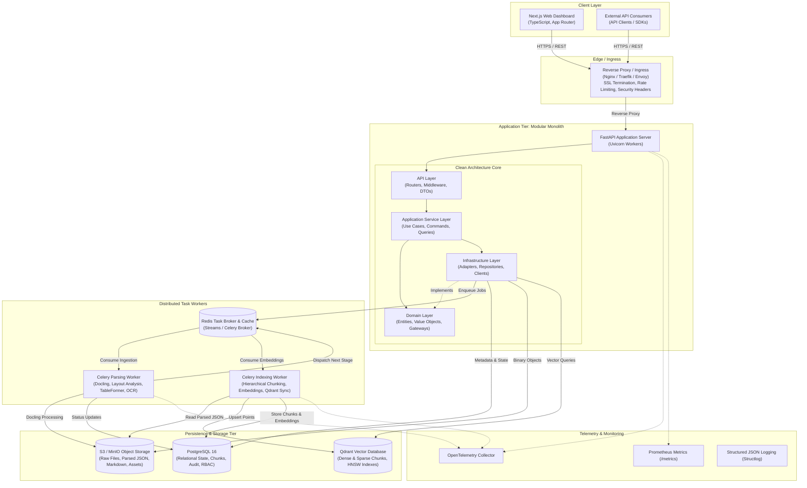
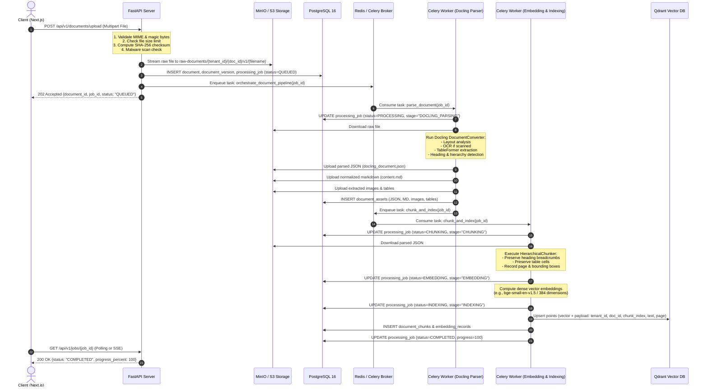
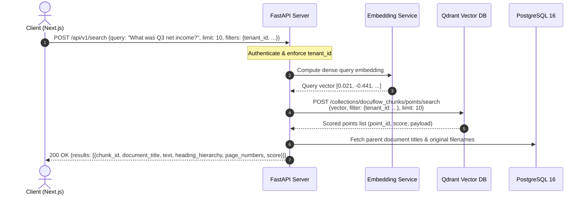

# DocuFlow AI — System Architecture Specification

**Author:** Principal Software Architect  
**Status:** Approved  
**Version:** 1.0.0  
**Last Updated:** 2026-09-06  

---

## 1. Executive Summary & System Vision

**DocuFlow AI** is an enterprise-grade Document Intelligence and AI Ingestion Platform engineered to transform unstructured, multi-format organizational documents into structured, semantically searchable, and AI-ready assets. 

Organizations operate across fragmented document formats (PDF, DOCX, PPTX, XLSX, scanned images, HTML, Markdown). Traditional document parsing tools fail to preserve reading order, hierarchy, complex table structures, or visual provenance. DocuFlow AI leverages **IBM Docling** to extract deep structural semantics (headings, sections, tables, figures, captions, layout provenance, and OCR) and provides a resilient, asynchronous, event-driven ingestion pipeline that chunks, embeds, and indexes document content into **Qdrant** for high-precision hybrid/semantic search.

The platform is built strictly with **Clean Architecture** as a **Modular Monolith**, ensuring clean separation of concerns, enterprise security, complete observability, and horizontal scalability without premature microservice overhead.

---

## 2. Core Architectural Principles

1. **Clean Architecture / Ports & Adapters (Hexagonal)**:
   - Business logic is decoupled from frameworks, databases, queues, and storage.
   - Core domain rules depend only on Python primitives and standard libraries.
   - External dependencies (FastAPI, SQLAlchemy, MinIO, Qdrant, Celery) are adapters fulfilling domain-defined gateway interfaces.
2. **Zero Business Logic in Presentation**:
   - FastAPI route handlers act strictly as protocol adapters (HTTP request validation, auth context extraction, response serialization).
   - Use cases encapsulate business workflows.
3. **Asynchronous Non-Blocking Ingestion**:
   - Heavy document parsing and embedding are offloaded to distributed Celery workers.
   - The API layer never blocks on document parsing or model inference.
4. **Idempotence and Resilience**:
   - Every processing task can be safely retried without side effects or duplicate data.
   - Deterministic content-addressable checksums and state checkpoints prevent redundant processing.
5. **Strict Multi-Tenant and Data Isolation**:
   - Tenant boundaries are strictly enforced across relational database queries, object storage keys, and vector search payload filters.
6. **Observability as a First-Class Citizen**:
   - Distributed correlation IDs (`X-Correlation-ID`) propagate across HTTP requests, Celery jobs, database operations, and logs.
   - Structured JSON logging, Prometheus metrics, and OpenTelemetry instrumentation built in from day one.

---

## 3. High-Level System Architecture



---

## 4. Clean Architecture Layer Breakdown

The codebase is organized into four concentric layers. Dependencies point strictly inwards towards the Domain.

```text
[ API Layer (FastAPI, Routers, DTOs) ]
            │
            ▼
[ Application Layer (Use Cases, Commands, Queries) ]
            │
            ▼
[ Domain Layer (Entities, Value Objects, Domain Exceptions, Gateway Interfaces) ]
            ▲
            │
[ Infrastructure Layer (SQLAlchemy, Celery, MinIO, Qdrant, Docling Adapters) ]
```

### 4.1 Domain Layer (`app/domain/`)
The innermost layer containing enterprise business concepts. It has **no dependencies** on external libraries (no FastAPI, no SQLAlchemy, no Celery, no Pydantic DB decorators).

- **Entities**: `User`, `Document`, `DocumentVersion`, `DocumentAsset`, `ProcessingJob`, `DocumentChunk`, `EmbeddingRecord`, `ProcessingError`, `AuditLog`.
- **Value Objects**: `DocumentId`, `TenantId`, `ChecksumSHA256`, `MimeType`, `HeadingHierarchy`, `BoundingBox`, `ProcessingStatus`.
- **Domain Exceptions**: `DocumentNotFoundException`, `UnsupportedFileFormatException`, `FileTooLargeException`, `CorruptedFileException`, `InvalidStateTransitionException`, `TenantAccessViolationException`.
- **Gateway Interfaces (Ports)**:
  - `StorageGateway`: Abstract methods for `save()`, `get()`, `delete()`, `generate_presigned_url()`.
  - `VectorStoreGateway`: Abstract methods for `upsert_chunks()`, `search()`, `delete_by_document()`.
  - `DocumentParserGateway`: Abstract methods for `parse()`, `extract_layout()`, `export_markdown()`.
  - `EmbeddingGateway`: Abstract methods for `generate_dense()`, `generate_sparse()`.
  - `MalwareScannerGateway`: Abstract methods for `scan()`.
  - `AuditLoggerGateway`: Abstract methods for `record_event()`.

### 4.2 Application Layer (`app/application/`)
Orchestrates domain entities to fulfill end-user use cases. Contains:
- **Use Cases**:
  - `UploadDocumentUseCase`: Validates file metadata, scans for malware, streams to storage, creates `Document` entity, schedules processing job.
  - `GetDocumentDetailsUseCase`: Retrieves document metadata, versions, and current job progress.
  - `SearchDocumentsUseCase`: Sanitizes search query, obtains query embeddings, queries vector store with tenant filters, enriches results with document metadata.
  - `ProcessDocumentPipelineUseCase`: Orchestrates the transition of document states during worker execution.
  - `RetryJobUseCase`: Validates retry budget and re-enqueues processing.
  - `CancelJobUseCase`: Sends cancellation signal and revokes worker tasks.
- **DTOs / Commands / Queries**: Pure Python dataclasses representing inputs and outputs.

### 4.3 Infrastructure Layer (`app/infrastructure/`)
Contains concrete adapters that satisfy the gateway interfaces defined in the Domain layer:
- **Persistence**: SQLAlchemy 2.0 async engine, declarative ORM models, Alembic migrations, PostgreSQL repository implementations.
- **Storage**: `S3StorageService` supporting AWS S3 and MinIO via `boto3` / `aioboto3`.
- **Vector Database**: `QdrantVectorRepository` utilizing `qdrant-client` for HNSW indexing and payload filtering.
- **Document Intelligence**: `DoclingParserAdapter` wrapping `docling.document_converter.DocumentConverter`.
- **Embedding Models**: `SentenceTransformerEmbeddingAdapter` (local models like `bge-small-en-v1.5`) or `OpenAIEmbeddingAdapter`.
- **Tasks & Queues**: Celery task definitions, Celery configuration, and Redis broker integration.
- **Security**: Argon2id password hashing, PyJWT access/refresh token handlers.

### 4.4 API / Presentation Layer (`app/api/`)
Provides the external HTTP REST interface using FastAPI:
- **Routers**: Thin route handlers grouped by resource (`/auth`, `/documents`, `/jobs`, `/search`, `/health`).
- **Dependencies**: Dependency injection using `fastapi.Depends` for database sessions, authenticated user contexts, and application use cases.
- **Middleware**: Global error handling, correlation ID tracking, rate limiting, and CORS.
- **Schemas**: Pydantic v2 schemas for request validation and response serialization.

---

## 5. Component Breakdown & Responsibilities

| Component | Technology | Responsibilities | Scaling Model |
| :--- | :--- | :--- | :--- |
| **Frontend UI** | Next.js 14+ (App Router), TypeScript | User dashboard, drag-and-drop document upload, real-time pipeline status tracking, visual document layout viewer, markdown preview, interactive chunk inspector, semantic search interface | Horizontal (Edge / CDN / Node server) |
| **API Server** | FastAPI, Uvicorn, Pydantic v2 | Ingestion endpoint, presigned URL generation, job status query, search dispatch, JWT auth, tenant isolation | Horizontal (Stateless containers behind Load Balancer) |
| **Parsing Worker** | Celery, Python 3.11, Docling, PyTorch, Tesseract | Heavy document conversion, OCR execution, TableFormer layout extraction, JSON/Markdown export generation | Dedicated worker pool with CPU/GPU optimization (concurrency 2-4 per pod) |
| **Indexing Worker** | Celery, SentenceTransformers | Hierarchical document chunking, dense vector inference, Qdrant payload preparation and batch indexing | Horizontally scaled worker pool (I/O & compute bound) |
| **Relational DB** | PostgreSQL 16 | ACID transactions, document metadata, versions, chunks, job audit records, users and RBAC | Primary-replica configuration, connection pooling with PgBouncer |
| **Task Broker & Cache** | Redis 7.2 | Celery message broker, task state backend, distributed rate-limiting counters, token revocation blocklist | Redis Sentinel or Redis Cluster with persistence (AOF) |
| **Object Storage** | MinIO / AWS S3 | Content-addressable storage for raw uploaded documents, parsed Docling JSON models, exported Markdown, and extracted assets | S3-compatible multi-bucket architecture |
| **Vector Database** | Qdrant | Vector embedding indexing (HNSW), cosine similarity search, full-text lexical filtering, multi-tenant payload filtering | Distributed clustering with shard replicas |

---

## 6. Communication Protocols & Data Flow

### 6.1 End-to-End Ingestion Data Flow



### 6.2 Semantic Search & Retrieval Flow



---

## 7. Folder Structure & Codebase Organization

The repository is structured as a clear, maintainable monorepo containing the backend service, frontend application, infrastructure templates, tests, and documentation.

```text
docuflow-ai/
├── .github/
│   └── workflows/
│       ├── ci.yml                     # PR validation: linting, typing, unit & integration tests
│       └── docker-build.yml           # Container build & publish workflow
├── backend/
│   ├── alembic/                       # Database schema migrations
│   │   ├── versions/                  # Version migration scripts
│   │   ├── env.py                     # Alembic async migration environment
│   │   └── script.py.mako
│   ├── app/
│   │   ├── __init__.py
│   │   ├── main.py                    # Application factory, lifespan, CORS, middleware
│   │   ├── config.py                  # Pydantic Settings (validated environment variables)
│   │   ├── api/                       # Presentation Layer
│   │   │   ├── __init__.py
│   │   │   ├── dependencies.py        # DI providers: get_db, get_current_user, get_storage
│   │   │   ├── middleware.py          # Request logging, correlation ID, rate limiter
│   │   │   └── v1/
│   │   │       ├── __init__.py
│   │   │       ├── router.py          # Aggregated API v1 router
│   │   │       ├── auth.py            # Login, register, refresh, logout
│   │   │       ├── documents.py       # Upload, list, get, delete, assets, chunks
│   │   │       ├── jobs.py            # Job status, retry, cancellation
│   │   │       ├── search.py          # Semantic & hybrid search endpoints
│   │   │       └── health.py          # Liveness, readiness, prometheus metrics
│   │   ├── application/               # Application Service Layer
│   │   │   ├── __init__.py
│   │   │   ├── common/                # Base DTOs, result types, pagination helpers
│   │   │   ├── auth/                  # User authentication use cases
│   │   │   ├── documents/             # Upload, retrieve, delete document use cases
│   │   │   ├── jobs/                  # Job tracking, retry, cancel use cases
│   │   │   └── search/                # Semantic query use cases
│   │   ├── domain/                    # Pure Domain Layer
│   │   │   ├── __init__.py
│   │   │   ├── entities/              # Document, Chunk, Job, User, Asset
│   │   │   ├── value_objects/         # Checksum, MimeType, BoundingBox
│   │   │   ├── exceptions.py          # Enterprise business exceptions
│   │   │   └── interfaces/            # Abstract Gateway interfaces (Ports)
│   │   │       ├── storage.py
│   │   │       ├── vector_store.py
│   │   │       ├── parser.py
│   │   │       ├── embedding.py
│   │   │       ├── malware_scanner.py
│   │   │       └── audit_logger.py
│   │   └── infrastructure/            # Infrastructure Layer (Adapters)
│   │       ├── __init__.py
│   │       ├── database/              # SQLAlchemy models, session factory, repositories
│   │       ├── storage/               # S3 / MinIO Boto3 implementation
│   │       ├── vector/                # Qdrant client implementation
│   │       ├── parser/                # Docling document converter adapter
│   │       ├── embeddings/            # SentenceTransformers embedding adapter
│   │       ├── security/              # Password hashing (Argon2), JWT token manager
│   │       ├── logging/               # Structlog configuration & processors
│   │       └── tasks/                 # Celery app, task definitions, workflows
│   │           ├── celery_app.py      # Worker configuration & queues
│   │           ├── pipeline.py        # Orchestration canvas / workflow tasks
│   │           ├── parsing_tasks.py   # Docling conversion tasks
│   │           └── indexing_tasks.py  # Chunking, embedding, vector upsert tasks
│   ├── tests/
│   │   ├── conftest.py                # Pytest fixtures, test database, mock gateways
│   │   ├── unit/                      # Domain and application unit tests
│   │   ├── integration/               # API, database, S3, Qdrant integration tests
│   │   └── fixtures/                  # Sample test documents (PDF, DOCX, XLSX, etc.)
│   ├── Dockerfile                     # Multi-stage production container for API & Celery
│   ├── pyproject.toml                 # Poetry / Pip dependency specifications
│   └── alembic.ini                    # Alembic migration configuration
├── frontend/
│   ├── public/                        # Static brand assets, favicon, icons
│   ├── src/
│   │   ├── app/                       # Next.js 14+ App Router
│   │   │   ├── layout.tsx             # Root layout with providers (QueryClient, Auth)
│   │   │   ├── page.tsx               # Landing / overview dashboard
│   │   │   ├── login/                 # Authentication page
│   │   │   ├── documents/
│   │   │   │   ├── page.tsx           # Document library & upload dropzone
│   │   │   │   └── [id]/page.tsx      # Document detail & visual intelligence viewer
│   │   │   └── search/
│   │   │       └── page.tsx           # Semantic & hybrid search workbench
│   │   ├── components/                # Modular UI components
│   │   │   ├── layout/                # AppShell, Navigation, UserHeader
│   │   │   ├── ui/                    # Button, Input, Modal, Badge, Dropdown primitives
│   │   │   ├── upload/                # Dropzone, FileCard, ProgressModal
│   │   │   ├── documents/             # DocumentList, StatusPill, FilterControls
│   │   │   ├── viewer/                # SplitViewer, StructureTree, MarkdownRenderer
│   │   │   └── search/                # SearchInput, FilterDrawer, ResultCard
│   │   ├── hooks/                     # Custom React hooks (useAuth, useDocuments, useJobStatus)
│   │   ├── lib/                       # API client (Axios/Fetch), auth token utils
│   │   ├── styles/                    # Design tokens, variables.css, theme.css
│   │   └── types/                     # TypeScript API schemas and entity definitions
│   ├── package.json
│   ├── tsconfig.json
│   ├── next.config.mjs
│   └── Dockerfile
├── docs/                              # Architecture and Technical Documentation
│   ├── architecture.md
│   ├── database.md
│   ├── api.md
│   ├── processing-pipeline.md
│   ├── security.md
│   ├── deployment.md
│   ├── development-roadmap.md
│   └── adr/                           # Architectural Decision Records
├── docker-compose.yml                 # Local multi-service development stack
├── docker-compose.prod.yml            # Production container stack template
└── README.md                          # Repository overview and setup guide
```

---

## 8. Cross-Cutting Architectural Concerns

### 8.1 Scalability Strategy
- **Stateless Web API**: FastAPI instances are completely stateless. User identity is carried via signed JWT tokens. Instances can scale horizontally behind any standard Layer 7 load balancer.
- **Differentiated Worker Autoscaling**: Docling parsing (CPU/RAM heavy) and vector indexing (I/O & GPU heavy) run on dedicated Celery worker pools. Workers scale independently based on the queue depth of `docuflow.parsing` and `docuflow.indexing`.
- **Database Connection Pooling**: PostgreSQL connections are managed via async SQLAlchemy connection pooling with health check pings, backed by PgBouncer in high-concurrency production deployments.
- **Qdrant Vector Sharding**: As document chunk volume expands into millions of vectors, Qdrant partitions collections into multiple shards distributed across cluster nodes.

### 8.2 Observability & Telemetry
- **Correlation ID Tracking**: Every inbound HTTP request is assigned a unique `X-Correlation-ID` header (or preserves an existing one). This ID is passed to Celery task headers and bound to every log entry emitted by `structlog`.
- **Metrics**: Standardized Prometheus metrics exposed at `/health/metrics`:
  - Request rate, latency, and status code distribution.
  - Celery queue depth and active worker counts.
  - Document conversion duration histograms partitioned by file format.
  - Qdrant query latency and embedding generation latency.
- **Distributed Tracing**: OpenTelemetry SDK auto-instruments FastAPI request lifecycles, SQLAlchemy query execution, Redis commands, and Celery task execution spans.

### 8.3 Security Architecture Summary
- **Multi-Tenant Isolation**: Mandatory tenant filters at every layer (relational database queries, S3 prefixes, Qdrant payload filters).
- **Hardened File Ingestion**: Double validation of file extensions against magic bytes (`python-magic`), strict 50MB file size ceiling, and safe filename randomization to thwart directory traversal attacks.
- **Pluggable Malware Scanning**: Domain-level `MalwareScannerGateway` interface supporting ClamAV daemons in enterprise environments.
- **Secure Token Lifecycle**: Short-lived JWT access tokens (15 minutes) paired with cryptographically secure, revokable refresh tokens (7 days) stored with Argon2 hashing in PostgreSQL.

---

## 9. Technology Stack Matrix

| Area | Component / Tool | Version | Justification |
| :--- | :--- | :--- | :--- |
| **Backend Language** | Python | 3.11+ | Native ecosystem for AI, Docling, PyTorch, SentenceTransformers |
| **API Framework** | FastAPI | 0.111+ | High-performance ASGI framework, automatic OpenAPI generation, Pydantic v2 support |
| **Data Validation** | Pydantic v2 | 2.7+ | Rust-accelerated validation, strict type enforcement |
| **ORM / Migration** | SQLAlchemy / Alembic | 2.0+ / 1.13+ | Industry-standard async ORM with complete migration versioning |
| **Document Engine** | IBM Docling | 2.0+ | State-of-the-art document layout parsing, TableFormer, OCR, and structured representation |
| **Task Queue** | Celery + Redis | 5.4+ / 7.2+ | Mature distributed task execution, canvas orchestration, retry backoff |
| **Relational Storage**| PostgreSQL | 16+ | Robust ACID compliance, native JSONB support, relational integrity |
| **Object Storage** | MinIO / AWS S3 | S3 API | Scalable, content-addressable storage for large binary files and extracted assets |
| **Vector Database** | Qdrant | 1.9+ | Fast HNSW indexing, memory-mapped vectors, rich multi-tenant payload filtering |
| **Frontend Framework**| Next.js | 14+ (App Router) | React Server Components, high performance, robust enterprise ecosystem |
| **Frontend Language** | TypeScript | 5.4+ | Type safety across API DTOs and UI component props |
| **Logging** | Structlog | 24.1+ | Structured JSON logging with automatic context binding |
| **Testing** | Pytest / Playwright | Latest | Comprehensive unit, integration, and end-to-end browser testing |
