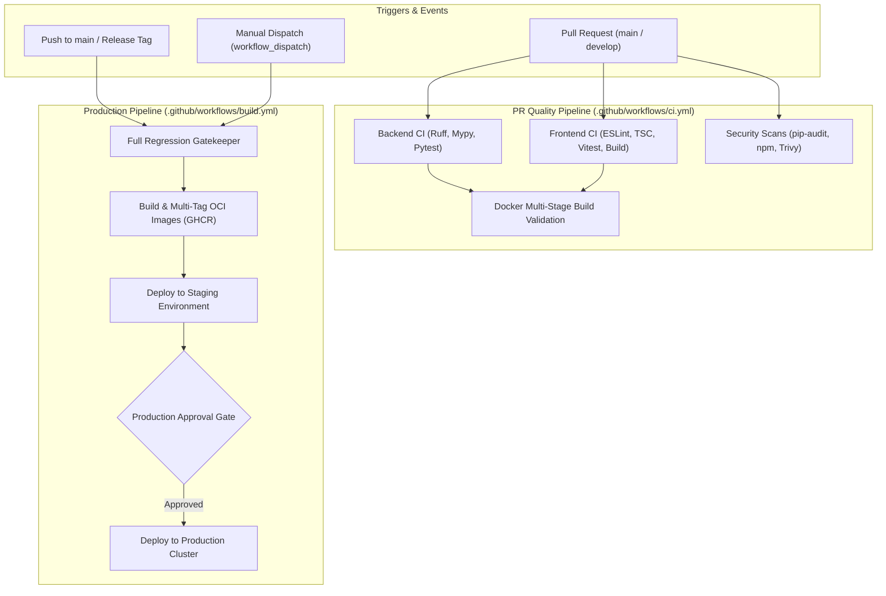

# DocuFlow AI — Production CI/CD Pipeline Architecture

DocuFlow AI utilizes **GitHub Actions** for end-to-end continuous integration, vulnerability scanning, multi-architecture container packaging, semantic version tagging, and gated zero-downtime production deployments.

---

## 1. Pipeline Overview & Architecture



---

## 2. Workflows Specification

### 2.1 Continuous Integration (`.github/workflows/ci.yml`)

The CI workflow executes on every Pull Request and feature branch push. All jobs run in parallel to maximize throughput and minimize developer wait times.

| Job Name | Steps Executed | Tools / Flags | Failure Conditions |
| :--- | :--- | :--- | :--- |
| **`backend-ci`** | Python 3.11 setup, dependency install with pip cache, Ruff format & lint check, Mypy static typing, Alembic migration dry-run SQL check, Pytest with coverage. | `ruff check app tests`<br>`ruff format --check`<br>`mypy app`<br>`alembic upgrade head --sql`<br>`pytest --cov=app` | Any lint/format violation, type error, broken migration, or test failure. |
| **`frontend-ci`** | Node.js 20 setup, npm dependency install, ESLint check, TypeScript compiler check, Vitest unit/component suite, Next.js production build. | `npm run lint`<br>`npx tsc --noEmit`<br>`npm test`<br>`npm run build` | ESLint errors, type mismatch, failed component test, or build failure. |
| **`security-audit`** | Python package vulnerability audit, NPM package vulnerability audit, Trivy filesystem security scanner. | `pip-audit -r backend/requirements.txt`<br>`npm audit --audit-level=high`<br>`aquasecurity/trivy-action` | High/Critical known CVE vulnerabilities. |
| **`docker-validation`** | Multi-stage Docker build validation for both Backend API/Worker and Frontend Next.js standalone container. | `docker/build-push-action@v5`<br>`cache-from: type=gha` | Syntax errors, missing dependencies, or multistage copy errors. |

---

### 2.2 Production Build & Publishing (`.github/workflows/build.yml`)

The Build workflow triggers upon merging to `main`, publishing semantic release tags (`v*.*.*`), or via manual `workflow_dispatch`.

#### Artifact & Image Tagging Strategy

Every build generates standard Open Container Initiative (OCI) image tags:
1. **Commit SHA**: `sha-a1b2c3d` (Immutable traceability)
2. **Branch Name**: `branch-main` or `branch-develop`
3. **Semantic Versioning**: `v1.2.0`, `1.2`, `1` (Triggered on release tags)
4. **Latest Pointer**: `latest` (Updated exclusively on default branch `main`)

#### Published Packages
- `ghcr.io/<org>/docuflow-ai/backend`: Multi-stage Python 3.11 image hosting FastAPI API and Celery workers.
- `ghcr.io/<org>/docuflow-ai/frontend`: Multi-stage Node.js 20 image hosting Next.js 16 standalone server.

---

## 3. Secret Management & Zero-Leakage Policy

DocuFlow AI strictly prohibits embedding secrets in source code, Docker images, or CI logs:

### 3.1 Secret Protection Controls
- **Automated Masking**: Sensitive tokens are passed through GitHub Actions `::add-mask::<secret>` before execution.
- **Least Privilege Access**: GitHub Container Registry access utilizes the ephemeral `GITHUB_TOKEN` with scoped `packages: write` permissions.
- **Environment Isolation**: Production credentials (`PROD_DATABASE_URL`, `PROD_JWT_SECRET_KEY`, `PROD_DEPLOY_KEY`) are stored inside GitHub Repository Environments with restricted access rules.

### 3.2 Required Repository Secrets

| Secret Key | Description | Environment |
| :--- | :--- | :--- |
| `GITHUB_TOKEN` | Automatically provisioned token for GHCR package publishing | Global |
| `STAGING_DEPLOY_KEY` | SSH / Kubeconfig deployment credentials for Staging | `staging` |
| `STAGING_API_TOKEN` | Staging cluster webhook / API token | `staging` |
| `PROD_DEPLOY_KEY` | Production cluster deployment credentials | `production` |
| `PROD_DATABASE_URL` | Production PostgreSQL connection string | `production` |
| `PROD_JWT_SECRET_KEY` | High-entropy 256-bit production JWT signing key | `production` |

---

## 4. Production Deployment & Approval Gates

To safeguard enterprise reliability:

1. **No Direct Production Deploys**: Pull requests cannot deploy directly to production.
2. **Staging Verification**: Every merge to `main` deploys to the staging environment first.
3. **Manual Reviewer Sign-Off**: Deploying to production requires an explicit review from authorized repository maintainers configured under **Settings > Environments > production > Required reviewers**.

---

## 5. Local CI Simulation

Developers can test and validate all CI checks locally prior to opening a Pull Request:

### 5.1 Backend Validation Commands
```bash
# 1. Format and Lint
cd backend
ruff format app tests
ruff check app tests --fix

# 2. Type Checking
mypy app

# 3. Database Migration Dry Run
alembic upgrade head --sql

# 4. Run Pytest Suite with Coverage
pytest --cov=app --cov-report=term-missing
```

### 5.2 Frontend Validation Commands
```bash
cd frontend
# 1. Lint and Type Check
npm run lint
npx tsc --noEmit

# 2. Run Tests
npm test

# 3. Production Build
npm run build
```

### 5.3 Local Workflow Execution via `act`
If [nektos/act](https://github.com/nektos/act) is installed locally:
```bash
act pull_request -j backend-ci
act pull_request -j frontend-ci
```

---

## 6. Rollback & Disaster Recovery

If a production incident occurs post-deployment:

1. **Instant Image Reversion**:
   Deploy the previous immutable SHA tag using `workflow_dispatch`:
   ```bash
   gh workflow run build.yml -f deploy_target=production -f git_ref=sha-<previous_sha>
   ```
2. **Database Schema Rollback**:
   Execute Alembic downgrade for target migration:
   ```bash
   alembic downgrade -1
   ```
3. **Traffic Canary Cutover**:
   Switch the ingress routing / load balancer back to the previous healthy cluster replica set.
