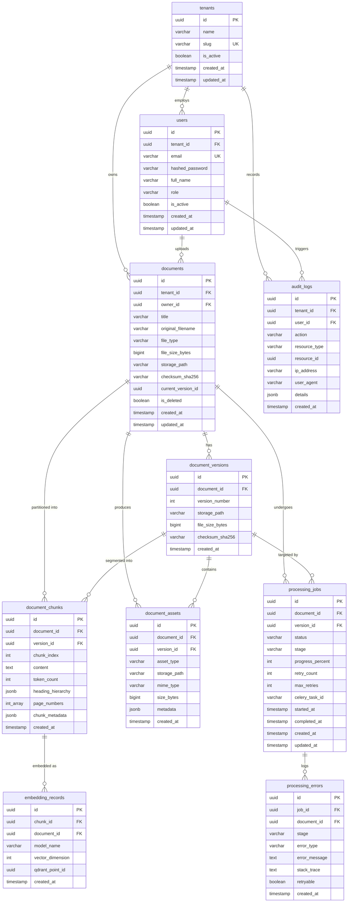

# DocuFlow AI — Database Schema & Persistence Architecture

**Author:** Principal Software Architect  
**Status:** Approved  
**Version:** 1.0.0  
**Last Updated:** 2026-09-06  

---

## 1. Overview & Architectural Principles

DocuFlow AI relies on **PostgreSQL 16+** as its primary system of record for all structured state: user authentication, tenant boundaries, document metadata, version history, extracted assets, chunk indexes, processing lifecycle states, errors, and audit logs.

### Core Database Design Principles
1. **Strict Multi-Tenancy**: Every business entity contains a `tenant_id` foreign key. Queries, updates, and deletes must scope to this tenant boundary.
2. **ACID Transactions**: State transitions for document ingestion, version increments, and job executions are executed within atomic transactions.
3. **Immutability of Versions & Chunks**: Once created, `document_versions`, `document_assets`, `document_chunks`, and `embedding_records` are immutable. Updates create a new version, preserving full historical provenance.
4. **Optimized for Ingestion and Search**: Indexes are strategically designed for high-concurrency ingestion and low-latency chunk retrieval, including B-Tree indexes on foreign keys and GIN indexes on JSONB metadata.
5. **Alembic Versioning**: All schema alterations are version-controlled through reversible Alembic migrations adhering to the **Expand and Contract** pattern for zero-downtime deployments.

---

## 2. Entity-Relationship Diagram (ERD)



---

## 3. Detailed Entity Dictionary

### 3.1 `tenants`
Represents an isolated organizational workspace or account.
- **`id`** (`UUID`, PK, default: `gen_random_uuid()`): Unique tenant identifier.
- **`name`** (`VARCHAR(255)`, NOT NULL): Human-readable organization name.
- **`slug`** (`VARCHAR(100)`, UNIQUE, NOT NULL): URL-safe tenant identifier.
- **`is_active`** (`BOOLEAN`, NOT NULL, default: `TRUE`): Soft disable flag for tenant account.
- **`created_at`** (`TIMESTAMP WITH TIME ZONE`, NOT NULL, default: `NOW()`): Account creation timestamp.
- **`updated_at`** (`TIMESTAMP WITH TIME ZONE`, NOT NULL, default: `NOW()`): Last modification timestamp.

### 3.2 `users`
Represents platform operators and consumers belonging to a tenant.
- **`id`** (`UUID`, PK, default: `gen_random_uuid()`): Unique user identifier.
- **`tenant_id`** (`UUID`, FK -> `tenants.id`, NOT NULL): Tenant reference.
- **`email`** (`VARCHAR(255)`, NOT NULL): Unique login email address.
- **`hashed_password`** (`VARCHAR(255)`, NOT NULL): Argon2id hashed password string.
- **`full_name`** (`VARCHAR(255)`, NOT NULL): User display name.
- **`role`** (`VARCHAR(50)`, NOT NULL, default: `'VIEWER'`): RBAC role (`ADMIN`, `EDITOR`, `VIEWER`).
- **`is_active`** (`BOOLEAN`, NOT NULL, default: `TRUE`): Status indicator.
- **`created_at`** (`TIMESTAMP WITH TIME ZONE`, NOT NULL, default: `NOW()`).
- **`updated_at`** (`TIMESTAMP WITH TIME ZONE`, NOT NULL, default: `NOW()`).
- **Constraints**:
  - `UNIQUE(tenant_id, email)`

### 3.3 `documents`
Represents the root entity of an ingested document.
- **`id`** (`UUID`, PK, default: `gen_random_uuid()`): Unique document identifier.
- **`tenant_id`** (`UUID`, FK -> `tenants.id`, NOT NULL): Enforces tenant isolation.
- **`owner_id`** (`UUID`, FK -> `users.id`, NOT NULL): The user who uploaded the document.
- **`title`** (`VARCHAR(255)`, NOT NULL): Display title (defaults to original filename).
- **`original_filename`** (`VARCHAR(255)`, NOT NULL): Sanitized original filename.
- **`file_type`** (`VARCHAR(100)`, NOT NULL): Verified MIME type (e.g., `application/pdf`).
- **`file_size_bytes`** (`BIGINT`, NOT NULL): File size in bytes.
- **`storage_path`** (`VARCHAR(512)`, NOT NULL): S3 URI / object key for the active version.
- **`checksum_sha256`** (`CHAR(64)`, NOT NULL): SHA-256 hash of the binary file content.
- **`current_version_id`** (`UUID`, NULLABLE): Foreign key to the active `document_versions` record.
- **`is_deleted`** (`BOOLEAN`, NOT NULL, default: `FALSE`): Soft deletion flag.
- **`created_at`** (`TIMESTAMP WITH TIME ZONE`, NOT NULL, default: `NOW()`).
- **`updated_at`** (`TIMESTAMP WITH TIME ZONE`, NOT NULL, default: `NOW()`).

### 3.4 `document_versions`
Maintains historical versions of a document when revisions are uploaded.
- **`id`** (`UUID`, PK, default: `gen_random_uuid()`).
- **`document_id`** (`UUID`, FK -> `documents.id` ON DELETE CASCADE, NOT NULL).
- **`version_number`** (`INT`, NOT NULL, default: `1`): Sequential version (1, 2, 3...).
- **`storage_path`** (`VARCHAR(512)`, NOT NULL): Object storage key for this specific version.
- **`file_size_bytes`** (`BIGINT`, NOT NULL).
- **`checksum_sha256`** (`CHAR(64)`, NOT NULL).
- **`created_at`** (`TIMESTAMP WITH TIME ZONE`, NOT NULL, default: `NOW()`).
- **Constraints**:
  - `UNIQUE(document_id, version_number)`

### 3.5 `document_assets`
Stores secondary files derived from Docling processing (e.g., parsed JSON representation, normalized Markdown, extracted images, extracted CSV tables).
- **`id`** (`UUID`, PK, default: `gen_random_uuid()`).
- **`document_id`** (`UUID`, FK -> `documents.id` ON DELETE CASCADE, NOT NULL).
- **`version_id`** (`UUID`, FK -> `document_versions.id` ON DELETE CASCADE, NOT NULL).
- **`asset_type`** (`VARCHAR(50)`, NOT NULL): Enum (`ORIGINAL`, `PARSED_JSON`, `EXPORT_MARKDOWN`, `EXTRACTED_IMAGE`, `TABLE_CSV`).
- **`storage_path`** (`VARCHAR(512)`, NOT NULL): S3 object key.
- **`mime_type`** (`VARCHAR(100)`, NOT NULL).
- **`size_bytes`** (`BIGINT`, NOT NULL).
- **`metadata`** (`JSONB`, NOT NULL, default: `'{}'::jsonb`): Stores asset-specific parameters (e.g., image dimensions, table row/column counts, page number).
- **`created_at`** (`TIMESTAMP WITH TIME ZONE`, NOT NULL, default: `NOW()`).

### 3.6 `processing_jobs`
Tracks asynchronous document ingestion pipelines executed by Celery workers.
- **`id`** (`UUID`, PK, default: `gen_random_uuid()`).
- **`document_id`** (`UUID`, FK -> `documents.id` ON DELETE CASCADE, NOT NULL).
- **`version_id`** (`UUID`, FK -> `document_versions.id` ON DELETE CASCADE, NOT NULL).
- **`status`** (`VARCHAR(30)`, NOT NULL, default: `'UPLOADED'`):
  - Values: `UPLOADED`, `QUEUED`, `PROCESSING`, `CHUNKING`, `EMBEDDING`, `INDEXING`, `COMPLETED`, `FAILED`, `CANCELLED`.
- **`stage`** (`VARCHAR(50)`, NOT NULL, default: `'INGESTION'`): Sub-stage within execution.
- **`progress_percent`** (`INT`, NOT NULL, default: `0`, CHECK: `progress_percent BETWEEN 0 AND 100`).
- **`retry_count`** (`INT`, NOT NULL, default: `0`).
- **`max_retries`** (`INT`, NOT NULL, default: `3`).
- **`celery_task_id`** (`VARCHAR(255)`, NULLABLE): Celery task UUID for revocation and tracing.
- **`started_at`** (`TIMESTAMP WITH TIME ZONE`, NULLABLE).
- **`completed_at`** (`TIMESTAMP WITH TIME ZONE`, NULLABLE).
- **`created_at`** (`TIMESTAMP WITH TIME ZONE`, NOT NULL, default: `NOW()`).
- **`updated_at`** (`TIMESTAMP WITH TIME ZONE`, NOT NULL, default: `NOW()`).

### 3.7 `document_chunks`
Stores text segments created by Docling's `HierarchicalChunker` with document hierarchy context.
- **`id`** (`UUID`, PK, default: `gen_random_uuid()`).
- **`document_id`** (`UUID`, FK -> `documents.id` ON DELETE CASCADE, NOT NULL).
- **`version_id`** (`UUID`, FK -> `document_versions.id` ON DELETE CASCADE, NOT NULL).
- **`chunk_index`** (`INT`, NOT NULL): Sequential index within the document.
- **`content`** (`TEXT`, NOT NULL): The actual chunk text content.
- **`token_count`** (`INT`, NOT NULL): Calculated token count.
- **`heading_hierarchy`** (`JSONB`, NOT NULL, default: `'[]'::jsonb`): Array of parent headings (e.g. `["1. Overview", "1.1 Architecture"]`).
- **`page_numbers`** (`INT[]`, NOT NULL): Array of physical document pages the chunk spans.
- **`chunk_metadata`** (`JSONB`, NOT NULL, default: `'{}'::jsonb`): Docling provenance, bounding boxes, item types (e.g. paragraph, table cell, list item).
- **`created_at`** (`TIMESTAMP WITH TIME ZONE`, NOT NULL, default: `NOW()`).
- **Constraints**:
  - `UNIQUE(version_id, chunk_index)`

### 3.8 `embedding_records`
Links relational chunks to their vector representations stored in Qdrant.
- **`id`** (`UUID`, PK, default: `gen_random_uuid()`).
- **`chunk_id`** (`UUID`, FK -> `document_chunks.id` ON DELETE CASCADE, NOT NULL).
- **`document_id`** (`UUID`, FK -> `documents.id` ON DELETE CASCADE, NOT NULL).
- **`model_name`** (`VARCHAR(100)`, NOT NULL): Embedding model identifier (e.g. `bge-small-en-v1.5`).
- **`vector_dimension`** (`INT`, NOT NULL): Number of vector dimensions (e.g. `384`).
- **`qdrant_point_id`** (`UUID`, NOT NULL): The matching point ID in Qdrant.
- **`created_at`** (`TIMESTAMP WITH TIME ZONE`, NOT NULL, default: `NOW()`).
- **Constraints**:
  - `UNIQUE(chunk_id, model_name)`

### 3.9 `processing_errors`
Detailed error logging for diagnostic analysis of failed jobs.
- **`id`** (`UUID`, PK, default: `gen_random_uuid()`).
- **`job_id`** (`UUID`, FK -> `processing_jobs.id` ON DELETE CASCADE, NOT NULL).
- **`document_id`** (`UUID`, FK -> `documents.id` ON DELETE CASCADE, NOT NULL).
- **`stage`** (`VARCHAR(50)`, NOT NULL): Pipeline stage when error occurred.
- **`error_type`** (`VARCHAR(100)`, NOT NULL): Python exception class name.
- **`error_message`** (`TEXT`, NOT NULL): Human-readable error description.
- **`stack_trace`** (`TEXT`, NULLABLE): Full traceback for debugging.
- **`retryable`** (`BOOLEAN`, NOT NULL, default: `FALSE`): Whether the error is deemed transient.
- **`created_at`** (`TIMESTAMP WITH TIME ZONE`, NOT NULL, default: `NOW()`).

### 3.10 `audit_logs`
Immutable compliance and security audit log.
- **`id`** (`UUID`, PK, default: `gen_random_uuid()`).
- **`tenant_id`** (`UUID`, FK -> `tenants.id`, NOT NULL).
- **`user_id`** (`UUID`, FK -> `users.id`, NULLABLE): User who initiated action, or NULL for system tasks.
- **`action`** (`VARCHAR(100)`, NOT NULL): Event code (e.g., `DOCUMENT_UPLOAD`, `DOCUMENT_DELETE`, `SEARCH_QUERY`, `JOB_RETRY`).
- **`resource_type`** (`VARCHAR(50)`, NOT NULL): Target entity type (`DOCUMENT`, `JOB`, `USER`).
- **`resource_id`** (`UUID`, NULLABLE): Target entity ID.
- **`ip_address`** (`VARCHAR(45)`, NULLABLE): Client IPv4 or IPv6.
- **`user_agent`** (`VARCHAR(512)`, NULLABLE): Client User-Agent string.
- **`details`** (`JSONB`, NOT NULL, default: `'{}'::jsonb`): Event-specific metadata.
- **`created_at`** (`TIMESTAMP WITH TIME ZONE`, NOT NULL, default: `NOW()`).

---

## 4. Indexing & Query Optimization Strategy

| Table | Index Name | Type | Columns | Rationale |
| :--- | :--- | :--- | :--- | :--- |
| `users` | `ix_users_tenant_email` | B-Tree | `(tenant_id, email)` | Fast authentication lookup and uniqueness verification |
| `documents` | `ix_docs_tenant_deleted_created` | B-Tree | `(tenant_id, is_deleted, created_at DESC)` | Primary document list dashboard query with pagination |
| `documents` | `ix_docs_tenant_checksum` | B-Tree | `(tenant_id, checksum_sha256)` | Deduplication check during upload |
| `document_versions` | `ix_doc_versions_doc_id` | B-Tree | `(document_id, version_number DESC)` | Fetch latest version of a document |
| `document_assets` | `ix_assets_version_type` | B-Tree | `(version_id, asset_type)` | Download specific asset (JSON, MD, images) |
| `processing_jobs` | `ix_jobs_status_created` | B-Tree | `(status, created_at)` | Polling active workers and dead-letter monitoring |
| `processing_jobs` | `ix_jobs_celery_task_id` | B-Tree | `(celery_task_id)` | Fast lookup during task callback / revocation |
| `document_chunks` | `ix_chunks_version_index` | B-Tree | `(version_id, chunk_index ASC)` | Sequential chunk reconstruction in document viewer |
| `document_chunks` | `ix_chunks_heading_gin` | GIN | `(heading_hierarchy jsonb_path_ops)` | Filter chunks by section breadcrumbs |
| `embedding_records` | `ix_embeddings_qdrant_point` | B-Tree | `(qdrant_point_id)` | Vector search result enrichment back to relational DB |
| `processing_errors` | `ix_errors_job_created` | B-Tree | `(job_id, created_at DESC)` | Display job failure details in UI |
| `audit_logs` | `ix_audit_tenant_action_created` | B-Tree | `(tenant_id, action, created_at DESC)` | Tenant compliance audit trail search |

---

## 5. Alembic Database Migration Strategy

### 5.1 Environment Configuration (`backend/alembic/env.py`)
Alembic is configured to run asynchronously using `asyncpg` engine connection. It dynamically loads metadata from `app.infrastructure.database.models.Base`.

```python
# Conceptual snippet from alembic/env.py
from app.infrastructure.database.models import Base
target_metadata = Base.metadata
```

### 5.2 Naming Convention & Structure
- Migration filenames: `<timestamp>_<descriptive_action_slug>.py` (e.g. `20260906120000_create_initial_document_tables.py`).
- Every migration must include both `upgrade()` and `downgrade()` functions.
- Migrations must run cleanly inside continuous integration test pipelines.

### 5.3 Zero-Downtime Migration Guidelines (Expand & Contract)
1. **Never drop a column or rename a table in a single step**:
   - **Phase 1 (Expand)**: Add the new column as nullable or with a safe default.
   - **Phase 2 (Dual Write)**: Deploy application code that reads from the old column but writes to both old and new.
   - **Phase 3 (Backfill)**: Run a background migration to backfill old records.
   - **Phase 4 (Contract)**: Deploy application code that reads only from the new column.
   - **Phase 5 (Cleanup)**: Drop the deprecated column in a subsequent migration.

---

## 6. Connection Pooling & Database Sizing

- **Driver**: `asyncpg` via SQLAlchemy 2.0 AsyncSession.
- **API Connection Pool**:
  - `pool_size`: 20 connections per API container.
  - `max_overflow`: 10 connections.
  - `pool_timeout`: 30 seconds.
  - `pool_recycle`: 1800 seconds (prevents stale TCP connections).
  - `pool_pre_ping`: `True` (verifies connection liveness before checkout).
- **Worker Connection Pool**:
  - Celery workers use `NullPool` with on-demand session lifecycles to avoid connection leaks across forked worker child processes.
- **Production PgBouncer Layer**:
  - In enterprise production, PgBouncer is deployed as a sidecar/ingress proxy in `transaction` pooling mode, allowing thousands of simultaneous frontend/worker connections to be efficiently multiplexed onto 50–100 PostgreSQL server backends.
