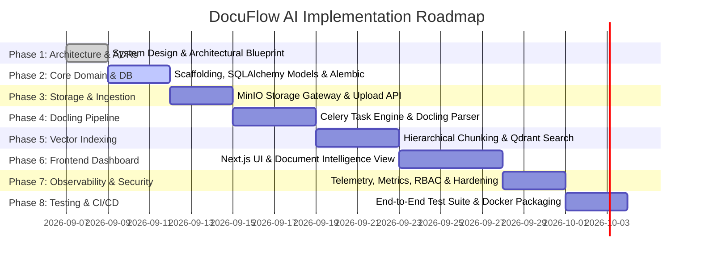

# DocuFlow AI — Engineering Roadmap & Phased Implementation Plan

**Author:** Principal Software Architect  
**Status:** Approved  
**Version:** 1.0.0  
**Last Updated:** 2026-09-06  

---

## 1. Roadmap Overview & Milestones

The DocuFlow AI implementation is structured across **eight sequential engineering phases**, balancing foundational reliability with rapid incremental delivery. Each phase defines explicit deliverables, automated verification criteria, and a rigid **Definition of Done (DoD)**.

---

## 2. Detailed Implementation Phases

### Phase 1: Architecture & ADR Suite (Current Phase)
- **Objectives**: Formulate the complete technical architecture, data model, API contracts, processing pipeline, security protocols, and infrastructure specification.
- **Key Deliverables**:
  - `/docs/architecture.md`
  - `/docs/database.md`
  - `/docs/api.md`
  - `/docs/processing-pipeline.md`
  - `/docs/security.md`
  - `/docs/deployment.md`
  - `/docs/development-roadmap.md`
  - `/docs/adr/0001` through `/docs/adr/0005`
- **Definition of Done**: All architectural documents approved and cross-referenced with zero ambiguity.

---

### Phase 2: Project Scaffolding & Core Domain
- **Objectives**: Initialize backend and frontend directory structures, establish Pydantic Settings, define pure domain entities/gateways, and configure PostgreSQL models with Alembic migrations.
- **Tasks**:
  1. Initialize Python virtual environment with Poetry / Pyproject (`fastapi`, `uvicorn`, `sqlalchemy[asyncio]`, `asyncpg`, `alembic`, `pydantic-settings`).
  2. Implement Domain layer (`app/domain/entities/`, `app/domain/value_objects/`, `app/domain/interfaces/`).
  3. Create SQLAlchemy models matching the ERD (`User`, `Tenant`, `Document`, `DocumentVersion`, `DocumentAsset`, `ProcessingJob`, `DocumentChunk`, `EmbeddingRecord`, `ProcessingError`, `AuditLog`).
  4. Configure async Alembic migration environment and generate the initial baseline migration.
  5. Setup `docker-compose.yml` for local PostgreSQL, Redis, MinIO, and Qdrant.
- **Definition of Done**: Baseline Alembic migration applies cleanly against local PostgreSQL; domain unit tests pass with 100% code coverage.

---

### Phase 3: Storage Gateway & Ingestion API
- **Objectives**: Implement the S3-compatible storage gateway, validate uploaded files, and provide the multipart upload REST endpoints.
- **Tasks**:
  1. Implement `S3StorageService` supporting AWS S3 and MinIO with presigned URL generation.
  2. Build stream-based file validator inspecting magic bytes (`puremagic`), enforce 50MB size limits, and calculate SHA-256 checksums.
  3. Implement `UploadDocumentUseCase` in the Application layer.
  4. Expose `POST /api/v1/documents/upload` and `GET /api/v1/documents` in FastAPI.
  5. Add `AuditLoggerGateway` and record audit log entries on document upload.
- **Definition of Done**: Users can upload PDF, DOCX, XLSX, and image files via HTTP; files land safely in MinIO; records persist in PostgreSQL.

---

### Phase 4: Docling Pipeline & Asynchronous Celery Engine
- **Objectives**: Integrate IBM Docling to convert multi-format documents, extract structured layouts, tables, and OCR, and manage lifecycle state transitions.
- **Tasks**:
  1. Configure Celery application with Redis broker and result backend.
  2. Implement `DoclingParserAdapter` wrapping `DocumentConverter` with `PdfPipelineOptions`, TableFormer, and OCR support.
  3. Implement Celery `parse_document_task` on dedicated `docuflow.parsing` queue.
  4. Generate and store `docling_document.json`, `content.md`, and extracted table CSVs / image crops to MinIO.
  5. Implement state machine transitions (`UPLOADED` -> `QUEUED` -> `PROCESSING` -> `CHUNKING`).
  6. Add error capture logging to `processing_errors` with retry backoff.
- **Definition of Done**: Uploaded documents automatically trigger Celery parsing; Docling JSON and Markdown exports are stored in MinIO; job status updates in real time.

---

### Phase 5: Chunking, Embeddings & Qdrant Vector Indexing
- **Objectives**: Segment parsed documents using hierarchical chunking, compute dense vectors, and index them into Qdrant for semantic search.
- **Tasks**:
  1. Implement Docling's `HierarchicalChunker` to extract chunks with heading breadcrumbs, table preservation, and page numbers.
  2. Implement `SentenceTransformerEmbeddingAdapter` using `bge-small-en-v1.5`.
  3. Implement `QdrantVectorRepository` for collection initialization and point upserts with multi-tenant filtering.
  4. Implement `chunk_and_embed_task` and `index_to_qdrant_task` on `docuflow.indexing` queue.
  5. Expose `POST /api/v1/search` with semantic and hybrid search filters.
- **Definition of Done**: Processed documents reach `COMPLETED` state; chunks are searchable via `/api/v1/search` returning relevant text snippets with section breadcrumbs.

---

### Phase 6: Frontend Dashboard & Document Intelligence Viewer
- **Objectives**: Develop the Next.js modern web dashboard with document upload dropzone, live job tracker, document visual structure viewer, and search workbench.
- **Tasks**:
  1. Initialize Next.js 14+ with TypeScript, App Router, and custom design tokens (dark mode, glassmorphism).
  2. Implement `AppShell`, sidebar navigation, and authentication state with TanStack Query.
  3. Build drag-and-drop file upload zone with real-time upload progress.
  4. Create document list table with live status badges and polling/SSE integration.
  5. Build `DocumentViewer` split-screen interface:
     - Left pane: Interactive hierarchical tree of headings, sections, and tables.
     - Right pane: Rendered Markdown with syntax highlighting and table formatting.
     - Chunk inspector modal with bounding box coordinates and token counts.
  6. Build semantic search page with natural language query input, score threshold sliders, and highlighted result snippets.
- **Definition of Done**: A user can upload a document through the browser, watch the progress advance in real time, view the structured document, and query it semantically.

---

### Phase 7: Observability, Security Hardening & Rate Limiting
- **Objectives**: Fortify the platform with enterprise security, RBAC enforcement, structured logging, and Prometheus metrics.
- **Tasks**:
  1. Implement Argon2id password hashing and JWT access/refresh token rotation.
  2. Enforce RBAC permissions (`ADMIN`, `EDITOR`, `VIEWER`) and tenant isolation middleware.
  3. Integrate `structlog` with correlation ID propagation (`X-Correlation-ID`) across API and Celery.
  4. Instrument endpoints with `prometheus-fastapi-instrumentator` at `/health/metrics`.
  5. Configure Redis-backed rate limiting on auth, upload, and search routes.
- **Definition of Done**: Penetration checks pass (no tenant leakage, rate limits trigger on abuse); structured logs and Prometheus metrics visible.

---

### Phase 8: Comprehensive Testing, CI/CD & Production Packaging
- **Objectives**: Build comprehensive test suites, configure GitHub Actions automation, and package optimized production Docker images.
- **Tasks**:
  1. Write Pytest unit tests for all use cases, chunkers, and domain entities.
  2. Write integration tests for API routes, database transactions, and Qdrant queries.
  3. Write Playwright end-to-end browser tests verifying the complete upload -> process -> search flow.
  4. Build GitHub Actions CI workflows (`ci.yml`, `docker-build.yml`).
  5. Test multi-stage production Dockerfiles with non-root security profiles.
- **Definition of Done**: 100% of CI checks pass; test coverage > 85%; production Docker containers boot cleanly.

---

## 3. Risk Management & Mitigation Matrix

| Risk Category | Risk Description | Probability | Impact | Mitigation Strategy |
| :--- | :--- | :---: | :---: | :--- |
| **Performance** | Large PDF (500+ pages) causes worker Out-Of-Memory (OOM) | Medium | High | Limit Celery worker concurrency to 2; stream pages in batches; configure worker memory limit recycling (`worker_max_memory_per_child`). |
| **Model Accuracy** | Scanned document OCR produces garbled text | Medium | Medium | Implement automatic layout detection with EasyOCR/Tesseract fallback and visual bounding box validation. |
| **Cold Starts** | Embedding model inference latency on CPU | Low | Medium | Use lightweight `bge-small-en-v1.5` (384-dim) with ONNX runtime acceleration. |
| **Queue Starvation** | Long-running Docling jobs block fast indexing jobs | High | High | Strict physical separation of Celery queues: `docuflow.parsing` vs `docuflow.indexing`. |
| **Vector DB Drift** | Relational chunk records out of sync with Qdrant | Low | High | Atomic state transaction; delete vector points when document is soft-deleted; daily sync verification script. |
