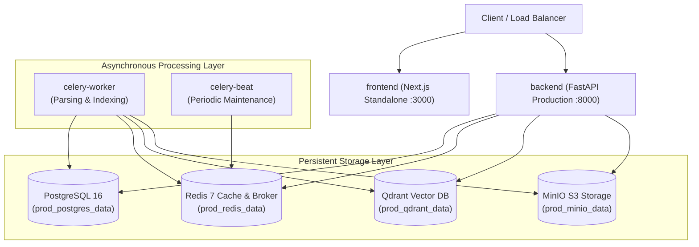

# DocuFlow AI — Production Docker & Container Hardening Operations Manual

DocuFlow AI containers are hardened for enterprise production environments, adhering to the principle of least privilege, minimal attack surface area, multi-stage layer optimization, and deterministic persistence across container lifecycles.

---

## 1. Container Hardening Principles

```
┌──────────────────────────────────────────────────────────────────┐
│                   Multi-Stage OCI Containers                     │
│                                                                  │
│  [ Stage 1: Builder ]          [ Stage 2: Minimal Runner ]       │
│  • Compiles wheels & assets    • Stripped build toolchains       │
│  • Installs dev dependencies   • Non-root user (UID 10001)       │
│                                • Tini PID 1 signal management    │
│                                • Built-in Docker HEALTHCHECKs    │
└──────────────────────────────────────────────────────────────────┘
```

### 1.1 Non-Root Security Policy
- All backend API and Celery workers run as `appuser:appgroup` (`UID: 10001, GID: 10001`).
- The Next.js frontend runs as `appuser:appgroup` (`UID: 10001, GID: 10001`).
- Root permissions are dropped during the build stage before application source files are transferred.

### 1.2 Signal Handling & Graceful Termination
- Both Dockerfiles wrap entrypoints with `tini` (`ENTRYPOINT ["tini", "--"]` / `["/sbin/tini", "--"]`).
- `docker stop` forwards `SIGTERM` directly to Uvicorn, Celery, and Node.js processes, enabling:
  - Uvicorn to finish in-flight HTTP requests.
  - Celery workers to finish active parsing/indexing tasks or safely re-queue them (`acks_late=True`).
  - Next.js to flush connection pools cleanly.

### 1.3 Secret Isolation (`.dockerignore`)
- Build contexts are protected by root, backend, and frontend `.dockerignore` files, ensuring no `.env*`, `.pem`, `.key`, `__pycache__`, or testing secrets are baked into container image layers.

---

## 2. Docker Compose Environment Matrix

| Environment | Compose File | Target Use Case | Features |
| :--- | :--- | :--- | :--- |
| **Development** | [`docker-compose.dev.yml`](file:///e:/Projects/DocuFlow%20AI/docker-compose.dev.yml) | Local developer environment | Source bind-mounts, hot-reloading (`--reload`, Fast Refresh), debug logs, exposed ports. |
| **Testing** | [`docker-compose.test.yml`](file:///e:/Projects/DocuFlow%20AI/docker-compose.test.yml) | Automated CI / ephemeral test runs | Ephemeral test databases, automated test runners for Pytest & Vitest with exit code reporting. |
| **Production** | [`docker-compose.prod.yml`](file:///e:/Projects/DocuFlow%20AI/docker-compose.prod.yml) | Production deployment cluster | Multi-replica backend, Celery worker + Celery beat, persistent volumes, log rotation, resource limits. |
| **Default** | [`docker-compose.yml`](file:///e:/Projects/DocuFlow%20AI/docker-compose.yml) | General local deployment | Canonical out-of-the-box local developer stack. |

---

## 3. Production Service Architecture



---

## 4. Operational Runbook

### 4.1 Starting the Development Environment
```bash
# Build and start all services in development mode with live reload
docker compose -f docker-compose.dev.yml up --build -d

# View live service logs
docker compose -f docker-compose.dev.yml logs -f backend celery-worker
```

### 4.2 Executing the Ephemeral Test Stack
```bash
# Run backend and frontend automated test suites in isolated containers
docker compose -f docker-compose.test.yml up --build --abort-on-container-exit

# Teardown test network and ephemeral containers
docker compose -f docker-compose.test.yml down -v
```

### 4.3 Production Deployment & Maintenance
```bash
# 1. Build and start the hardened production cluster
docker compose -f docker-compose.prod.yml up -d

# 2. Inspect health status of all running services
docker compose -f docker-compose.prod.yml ps

# 3. Graceful zero-data-loss restart
docker compose -f docker-compose.prod.yml restart

# 4. Graceful stop (preserves persistent volumes)
docker compose -f docker-compose.prod.yml stop

# 5. Full teardown without deleting persistent data
docker compose -f docker-compose.prod.yml down
```

---

## 5. Persistence Verification & Disaster Recovery

### 5.1 Verifying Volume Persistence
Data is mapped to named persistent Docker volumes:
- `docuflow_prod_postgres_data`
- `docuflow_prod_redis_data`
- `docuflow_prod_qdrant_data`
- `docuflow_prod_minio_data`

Running `docker compose -f docker-compose.prod.yml down` stops and removes the containers but leaves all four persistent volumes intact. When `docker compose -f docker-compose.prod.yml up -d` is executed subsequently, all relational rows, vector embeddings, and S3 file artifacts remain available.

### 5.2 Backup & Restoration Commands

#### PostgreSQL Backup:
```bash
docker exec docuflow-prod-postgres pg_dump -U docuflow docuflow_db > backup_postgres_$(date +%Y%m%d).sql
```

#### Qdrant Snapshot Creation:
```bash
curl -X POST http://localhost:6333/collections/docuflow_chunks/snapshots
```

#### MinIO Artifact Backup:
```bash
docker run --rm --network docuflow-prod-network -v $(pwd)/backups:/backup minio/mc \
  mirror local/docuflow-documents /backup/documents
```
