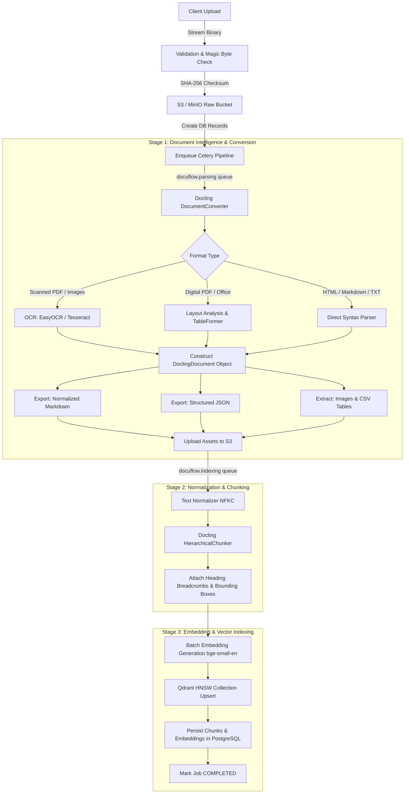
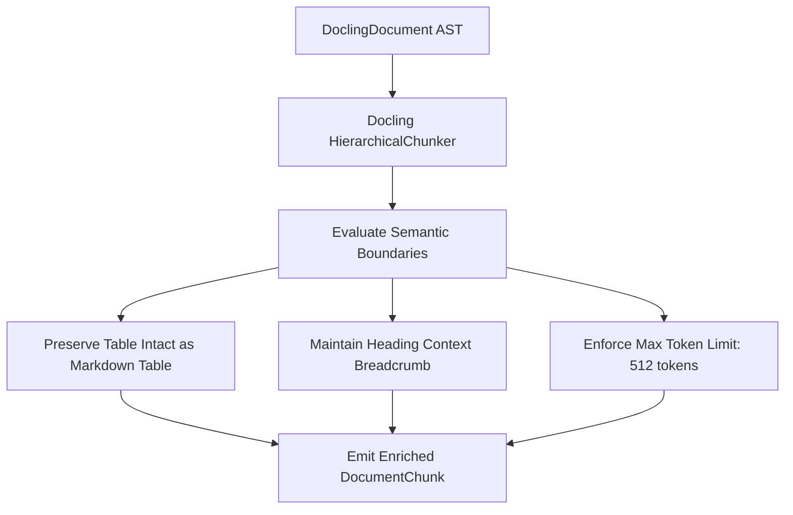
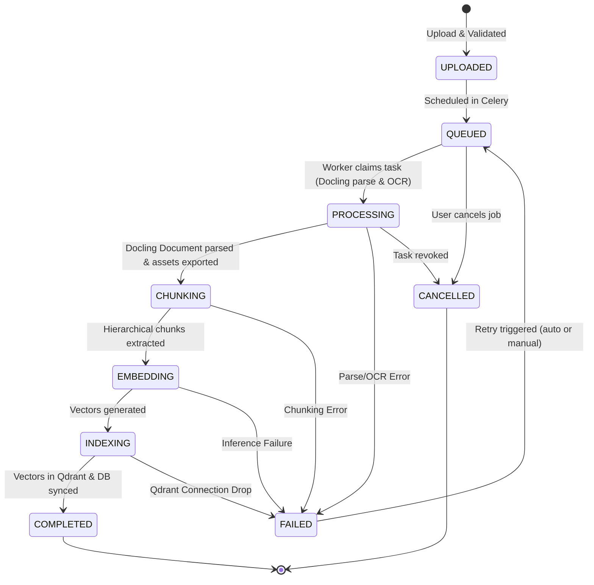

# DocuFlow AI — Document Processing Pipeline & Intelligence Specification

**Author:** Principal Software Architect  
**Status:** Approved  
**Version:** 1.0.0  
**Last Updated:** 2026-09-06  

---

## 1. Pipeline Overview & Objectives

The DocuFlow AI Document Processing Pipeline is an asynchronous, event-driven engine designed to parse diverse unstructured documents into rich semantic representations, extract structural hierarchy and layout metadata, intelligently chunk content without losing context, generate dense vector embeddings, and index them into Qdrant for semantic search.



---

## 2. Multi-Format Ingestion Handlers

DocuFlow AI natively ingests 10 distinct document formats:

| Format | Extension | Ingestion Strategy | Key Extraction Capabilities |
| :--- | :--- | :--- | :--- |
| **Portable Document Format** | `.pdf` | Docling PDF Pipeline with layout models & TableFormer | Hierarchical headings, reading order, multi-column text, embedded images, complex tables, bounding boxes |
| **Scanned PDF** | `.pdf` | Docling + EasyOCR / Tesseract CLI fallback | OCR bounding box recognition, skew correction, text transcription |
| **Microsoft Word** | `.docx` | Docling Office Pipeline | Section breaks, headings (H1-H6), inline styling, tables, bullet lists |
| **Microsoft PowerPoint** | `.pptx` | Docling Presentation Pipeline | Slide-by-slide hierarchy, text boxes, slide notes, embedded diagrams |
| **Microsoft Excel** | `.xlsx` | Docling Spreadsheet Pipeline / TableFormer | Multi-sheet parsing, column headers, cell coordinates, CSV conversion |
| **HyperText Markup** | `.html` | Docling HTML Parser | DOM tree traversal, article extraction, semantic tag preservation |
| **Markdown** | `.md` | CommonMark / Docling Markdown Parser | AST hierarchy parsing, code block fence preservation, frontmatter |
| **Plain Text** | `.txt` | Plaintext Parser | Sentence boundary detection, paragraph grouping |
| **Images** | `.png`, `.jpeg`, `.tiff` | Docling Image Pipeline + OCR | Optical layout analysis, visual table detection, OCR transcription |

---

## 3. IBM Docling Integration Architecture

DocuFlow AI encapsulates Docling through the `DocumentParserGateway` interface in the Domain layer, with concrete implementation in `DoclingParserAdapter` (`app/infrastructure/parser/docling_adapter.py`).

### 3.1 Pipeline Configuration & Options
```python
from docling.datamodel.base_models import InputFormat
from docling.datamodel.pipeline_options import (
    PdfPipelineOptions,
    EasyOcrOptions,
    TableFormerMode
)
from docling.document_converter import DocumentConverter, FormatOption

def build_document_converter(enable_ocr: bool = True) -> DocumentConverter:
    # Configure high-accuracy PDF parsing
    pdf_options = PdfPipelineOptions()
    pdf_options.do_ocr = enable_ocr
    pdf_options.ocr_options = EasyOcrOptions(force_full_page_ocr=False, lang=["en"])
    pdf_options.do_table_structure = True
    pdf_options.table_structure_options.mode = TableFormerMode.ACCURATE
    pdf_options.generate_page_images = True
    pdf_options.generate_picture_images = True

    return DocumentConverter(
        format_options={
            InputFormat.PDF: FormatOption(pipeline_options=pdf_options)
        }
    )
```

### 3.2 Output Model (`DoclingDocument`)
Docling returns an in-memory `DoclingDocument` containing:
- **`body`**: Top-level document container node.
- **Hierarchical Node Tree**: Nodes labeled as `SectionHeaderItem`, `ParagraphItem`, `TableItem`, `PictureItem`, `ListItem`, `CodeItem`.
- **Reading Order**: Explicit node sequencing that accurately traverses multi-column articles and financial reports without interspersing columns.
- **Table Structures**: Renderable as Markdown, HTML, or structured 2D cell grids with row/column spans.
- **Layout & Provenance**: Coordinates (`BoundingBox`: left, top, right, bottom) mapped to specific physical pages.

### 3.3 Asset Extraction & Normalization
Upon parsing, the worker generates:
1. **`docling_document.json`**: The complete serialized `DoclingDocument` JSON representation saved to `processed-artifacts/{tenant_id}/{doc_id}/v{version}/docling_document.json`.
2. **`content.md`**: Clean normalized Markdown exported via `doc.export_to_markdown()`, stored for fast full-text viewing.
3. **Extracted Figures**: High-resolution cropped images for all `PictureItem` elements, stored in `extracted-assets/.../images/{hash}.png`.
4. **Extracted Tables**: Individual tables exported to structured `.csv` format, stored in `extracted-assets/.../tables/{hash}.csv`.

---

## 4. Cleaning & Intelligent Chunking

Standard naive chunking (e.g. fixed 500-character windows) destroys table rows, splits sentences, and severs paragraphs from their section titles. DocuFlow AI uses **Hierarchical Structural Chunking**.



### 4.1 Hierarchical Chunking Rules
1. **Heading Breadcrumb Preservation**:
   - Every chunk retains its ancestral path: `["1. Financial Highlights", "1.2 Consolidated Balance Sheet"]`.
   - The breadcrumb is prepended to the chunk text during embedding to contextualize downstream vector search.
2. **Table Integrity**:
   - Small and medium tables are kept intact within a single chunk formatted as Markdown.
   - Large tables are chunked by rows while replicating the header row onto each chunk.
3. **Overlap & Token Bounds**:
   - Target token window: **384–512 tokens**.
   - Overlap: **50 tokens** across paragraph boundaries to avoid truncation of cross-sentence reasoning.
4. **Provenance Attachment**:
   - Physical page numbers (`int[]`) and bounding boxes (`{l, t, r, b}`) are embedded in the chunk metadata for visual highlighting in the UI.

---

## 5. Embeddings & Vector Indexing

### 5.1 Embedding Model
- **Default Provider**: Local ONNX/PyTorch `BAAI/bge-small-en-v1.5` (or `all-MiniLM-L6-v2`).
  - Dimensions: **384**
  - Metric: **Cosine Similarity**
  - Performance: ~15ms per batch on CPU, <2ms on GPU.
- **Enterprise Provider**: Pluggable adapter supporting OpenAI (`text-embedding-3-small`, 1536 dimensions) or Cohere Embed v3.

### 5.2 Qdrant Ingestion Strategy
Chunks are indexed in Qdrant in batches of 64:
```python
from qdrant_client.models import PointStruct

points = [
    PointStruct(
        id=str(chunk.id),
        vector=embedding_vector,
        payload={
            "tenant_id": str(tenant_id),
            "document_id": str(document_id),
            "version_id": str(version_id),
            "chunk_index": chunk.chunk_index,
            "text": chunk.content,
            "heading_hierarchy": chunk.heading_hierarchy,
            "page_numbers": chunk.page_numbers,
            "item_type": chunk.metadata.get("item_type"),
            "file_type": document.file_type,
            "created_at": int(document.created_at.timestamp())
        }
    )
    for chunk, embedding_vector in batch
]
qdrant_client.upsert(collection_name="docuflow_chunks", points=points)
```

---

## 6. Processing State Machine

The document ingestion lifecycle is governed by a strict deterministic state machine:



### State Transition Matrix

| Current State | Event / Trigger | Target State | Actions & Side Effects |
| :--- | :--- | :--- | :--- |
| `None` | `UPLOAD_SUCCESS` | `UPLOADED` | Raw file in S3; DB records created. |
| `UPLOADED` | `DISPATCH_TASK` | `QUEUED` | Task message pushed to Redis broker. |
| `QUEUED` | `WORKER_CLAIM` | `PROCESSING` | `started_at` logged; Docling initialized. |
| `PROCESSING`| `PARSE_COMPLETE` | `CHUNKING` | Assets written to S3; `document_assets` inserted. |
| `CHUNKING` | `CHUNKS_EXTRACTED` | `EMBEDDING` | `document_chunks` records created in DB. |
| `EMBEDDING` | `VECTORS_GENERATED`| `INDEXING` | Vector batches prepared in memory. |
| `INDEXING` | `INDEX_SUCCESS` | `COMPLETED` | Points in Qdrant; `completed_at` logged; progress 100%. |
| *Any State* | `EXCEPTION_RAISED` | `FAILED` | `processing_errors` logged; evaluate retry policy. |
| `FAILED` | `RETRY_TRIGGERED` | `QUEUED` | `retry_count` incremented; job re-enqueued. |
| `QUEUED` / `PROCESSING` | `USER_CANCEL` | `CANCELLED` | Celery task revoked with terminate signal. |

---

## 7. Celery Task Architecture & Canvas Orchestration

Celery workers are partitioned into two separate queues to prevent CPU-intensive OCR tasks from starving fast vector indexing tasks:

```text
docuflow.parsing   --> Concurrency: 2-4 (Worker with PyTorch, Docling, Tesseract)
docuflow.indexing  --> Concurrency: 8-16 (Worker with SentenceTransformers, Qdrant Client)
```

### Canvas Task Chain
Processing is constructed as a Celery canvas chain:

```python
from celery import chain
from app.infrastructure.tasks.parsing_tasks import parse_document_task
from app.infrastructure.tasks.indexing_tasks import chunk_and_embed_task, index_to_qdrant_task

def trigger_document_pipeline(job_id: str, document_id: str):
    pipeline = chain(
        parse_document_task.s(job_id=job_id, document_id=document_id).set(queue="docuflow.parsing"),
        chunk_and_embed_task.s().set(queue="docuflow.indexing"),
        index_to_qdrant_task.s().set(queue="docuflow.indexing")
    )
    return pipeline.apply_async()
```

---

## 8. Idempotence, Checkpoints & Failure Recovery

1. **Checksum Deduplication**:
   - When a file is uploaded, its SHA-256 hash is checked against active documents in the tenant.
   - If identical and previously `COMPLETED`, the system can instantly clone chunk references rather than re-running Docling parsing.
2. **Stage Checkpoints**:
   - Each task verifies whether its outputs already exist in S3/PostgreSQL. If `parse_document_task` succeeds but `chunk_and_embed_task` fails due to an external network glitch, retrying the job skips parsing and resumes directly from the cached `docling_document.json`.
3. **Exponential Backoff with Jitter**:
   ```python
   @celery_app.task(
       bind=True,
       autoretry_for=(TransientStorageError, QdrantConnectionError),
       retry_backoff=True,
       retry_backoff_max=300,
       retry_jitter=True,
       max_retries=3
   )
   def index_to_qdrant_task(self, context: dict):
       ...
   ```
4. **Dead-Letter Audit**:
   - Tasks exceeding `max_retries` transition to `FAILED` and record a full traceback in `processing_errors`. Platform administrators can inspect the error in the dashboard and trigger a 1-click retry.
