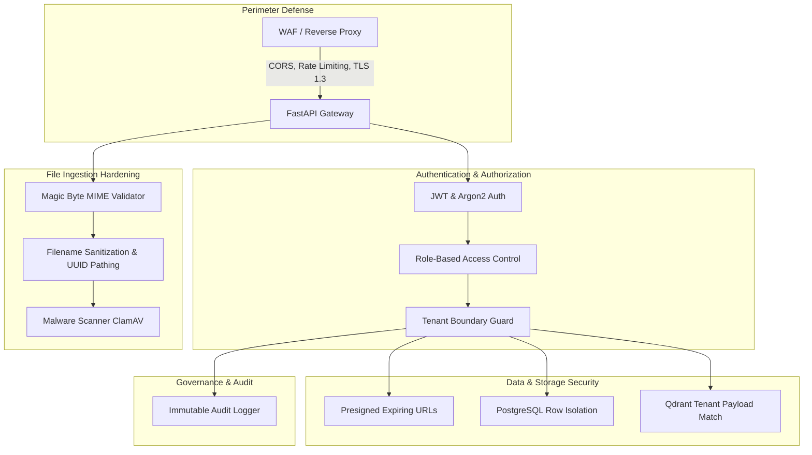

# DocuFlow AI — Security Architecture & Threat Mitigation

**Author:** Principal Software Architect  
**Status:** Approved  
**Version:** 1.0.0  
**Last Updated:** 2026-09-06  

---

## 1. Security Philosophy & Threat Model

DocuFlow AI handles sensitive enterprise documentation (financial statements, legal contracts, proprietary blueprints, health records). Security is designed in depth, enforcing defense mechanisms at the network boundary, application perimeter, persistence tier, and background processing workers.



### Primary Threat Vectors & Mitigations
| Threat Vector | Risk Scenario | Mitigation Mechanism |
| :--- | :--- | :--- |
| **Malicious File Upload** | Executable disguised as PDF or zip bomb | Magic byte validation (`puremagic`), 50MB hard stream limit, sandboxed parser execution |
| **Path Traversal** | Filenames with `../../etc/passwd` | Strip path components, generate internal randomized UUID storage keys |
| **Cross-Tenant Data Leak** | User in Tenant A queries documents in Tenant B | Enforce `tenant_id` at ORM repository layer and Qdrant payload filters |
| **Credential Compromise** | Stolen credentials or weak password hashes | Argon2id hashing, short-lived JWTs (15 min), revokable refresh tokens |
| **Brute Force / DoS** | Automated attacks on login or file upload | Redis-backed sliding window rate limiters (SlowAPI) |
| **Document Eavesdropping** | Interception of uploaded or exported files | TLS 1.3 in transit, AES-256 at rest, presigned URLs with 15-minute TTL |

---

## 2. Authentication & Session Architecture

### 2.1 Password Hashing (Argon2id)
All user passwords are encrypted using **Argon2id** (the winner of the Password Hashing Competition):
- **Type**: Argon2id (resistant to side-channel and GPU-assisted attacks)
- **Time Cost**: `2` iterations
- **Memory Cost**: `65,536 KB` (64 MB)
- **Parallelism**: `2` parallel threads

### 2.2 Token Lifecycle & Revocation
1. **Access Tokens**:
   - Format: Standard JWT signed with `HS256` (or `RS256` asymmetric keys).
   - Lifetime: **15 minutes**.
   - Claims: `sub` (User ID), `tenant_id`, `role`, `email`, `exp`, `iat`, `jti`.
2. **Refresh Tokens**:
   - Format: 256-bit cryptographically secure random token (`secrets.token_urlsafe(32)`).
   - Storage: Stored hashed in PostgreSQL with user ID and expiration timestamp.
   - Lifetime: **7 days**.
   - Transmission: Transported exclusively in HTTP-only, Secure, `SameSite=Strict` cookies to neutralize Cross-Site Scripting (XSS) extraction.
3. **Revocation & Logout**:
   - When a user logs out, the active refresh token is marked revoked in PostgreSQL and its identifier is pushed to a Redis revocation blocklist with a 7-day TTL.

---

## 3. Role-Based Access Control (RBAC) & Multi-Tenancy

### 3.1 Permission Matrix

| Action / Permission | ADMIN | EDITOR | VIEWER |
| :--- | :---: | :---: | :---: |
| `documents:read` (View documents, download assets) |  |  |  |
| `documents:write` (Upload new files, trigger re-runs) |  |  |  |
| `documents:delete` (Soft-delete documents) |  |  |  |
| `search:query` (Execute semantic & hybrid queries) |  |  |  |
| `jobs:retry` / `jobs:cancel` |  |  |  |
| `users:manage` (Invite, update roles, deactivate users) |  |  |  |
| `audit:read` (Inspect compliance audit logs) |  |  |  |

### 3.2 Tenant Isolation Enforcement
- **Database Level**: Every query generated by repository classes automatically applies `.filter(Document.tenant_id == current_user.tenant_id)`.
- **Vector Search Level**:
  ```python
  from qdrant_client.models import Filter, FieldCondition, MatchValue

  tenant_filter = Filter(
      must=[
          FieldCondition(
              key="tenant_id",
              match=MatchValue(value=str(current_user.tenant_id))
          )
      ]
  )
  ```
- **Storage Level**: S3 object keys are segregated under `tenants/{tenant_id}/...`.

---

## 4. Ingestion Hardening & File Validation

```text
Incoming File Stream
        │
        ▼
[ 1. Stream Size Counter ] ──> Exceeds 50MB? ──> Terminate (413 Payload Too Large)
        │ (Passed)
        ▼
[ 2. Magic Byte Sniffer ] ──> Mismatched Signature? ──> Terminate (415 Unsupported Media)
        │ (Passed)
        ▼
[ 3. Filename Sanitizer ] ──> Strip control chars & `..` ──> Assign UUID storage key
        │ (Passed)
        ▼
[ 4. Malware Scanner ] ──> ClamAV Daemon detects threat? ──> Quarantine & Log (400 Bad Request)
        │ (Passed)
        ▼
[ 5. Stream to S3 Raw Bucket ]
```

### 4.1 Strict Magic Byte Verification
The platform **never** relies on client-provided `Content-Type` headers or file extensions. During upload streaming, the first 4096 bytes are inspected using `puremagic` or `libmagic` to verify the actual file signature.

Allowed Signatures:
- PDF: `%PDF-` (`application/pdf`)
- DOCX: `PK\x03\x04` (`application/vnd.openxmlformats-officedocument.wordprocessingml.document`)
- XLSX: `PK\x03\x04` (`application/vnd.openxmlformats-officedocument.spreadsheetml.sheet`)
- PPTX: `PK\x03\x04` (`application/vnd.openxmlformats-officedocument.presentationml.presentation`)
- PNG: `\x89PNG\r\n\x1a\n` (`image/png`)
- JPEG: `\xff\xd8\xff` (`image/jpeg`)
- TIFF: `II*\x00` or `MM\x00*` (`image/tiff`)
- HTML / Markdown / TXT: Validated UTF-8 text with strict character encoding checks.

### 4.2 Safe Filename Sanitization
```python
import re
import unicodedata
from pathlib import Path

def sanitize_filename(filename: str) -> str:
    filename = unicodedata.normalize("NFKD", filename).encode("ascii", "ignore").decode("ascii")
    filename = re.sub(r"[^\w\s.-]", "", filename).strip()
    return re.sub(r"[-\s]+", "_", filename) or "unnamed_document"
```

### 4.3 Pluggable Malware Scanning Interface
```python
from abc import ABC, abstractmethod

class MalwareScannerGateway(ABC):
    @abstractmethod
    async def scan_stream(self, stream) -> bool:
        """Returns True if file is clean, False if infected."""
        pass
```
Production deployments integrate with ClamAV via `clamd` network daemon over TCP socket.

---

## 5. Network, Transport & HTTP Headers

### 5.1 Security Headers Middleware
All HTTP responses include mandatory security headers:
- `Strict-Transport-Security: max-age=31536000; includeSubDomains; preload`
- `X-Content-Type-Options: nosniff`
- `X-Frame-Options: DENY`
- `X-XSS-Protection: 1; mode=block`
- `Referrer-Policy: strict-origin-when-cross-origin`
- `Content-Security-Policy: default-src 'self'; script-src 'self'; style-src 'self' 'unsafe-inline'; img-src 'self' data: https:; font-src 'self'; connect-src 'self';`

### 5.2 Rate Limiting Policies (SlowAPI / Redis)
- `/api/v1/auth/login`: **5 requests / minute per IP** (brute-force defense).
- `/api/v1/documents/upload`: **20 requests / minute per user**.
- `/api/v1/search`: **60 requests / minute per user**.
- Global API rate: **300 requests / minute per IP**.

---

## 6. Audit Trail & Compliance Logging

All security-sensitive operations generate immutable audit events written to `audit_logs`:
- Actor: `user_id`, `tenant_id`, `ip_address`, `user_agent`.
- Event Code: `AUTH_LOGIN_SUCCESS`, `AUTH_LOGIN_FAILED`, `DOCUMENT_UPLOADED`, `DOCUMENT_DELETED`, `DOCUMENT_DOWNLOAD_URL_ISSUED`, `SEARCH_EXECUTED`.
- Target Resource: Resource type (`DOCUMENT`, `JOB`, `USER`) and resource UUID.
- Metadata: Key parameters (e.g. search query length, upload file size, error reasons).
