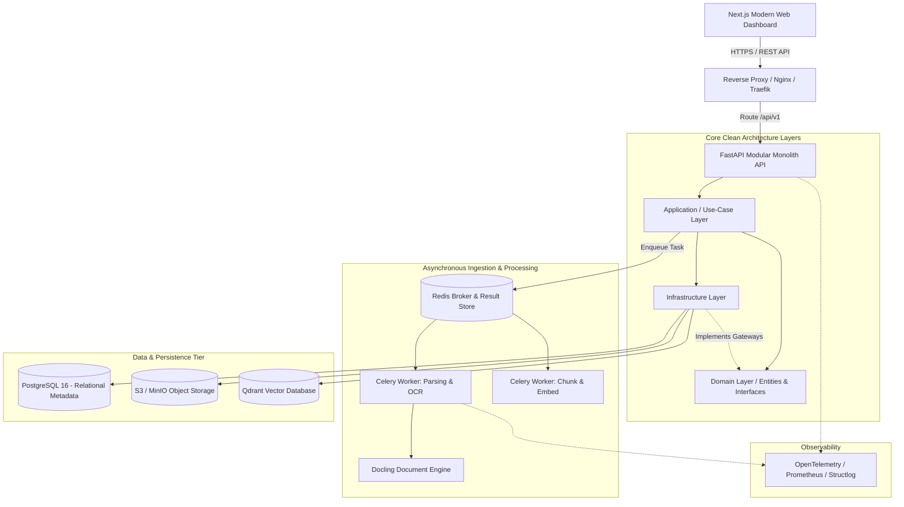
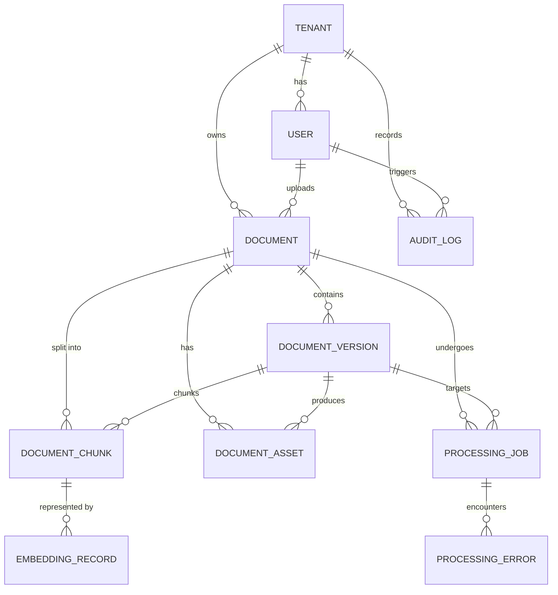
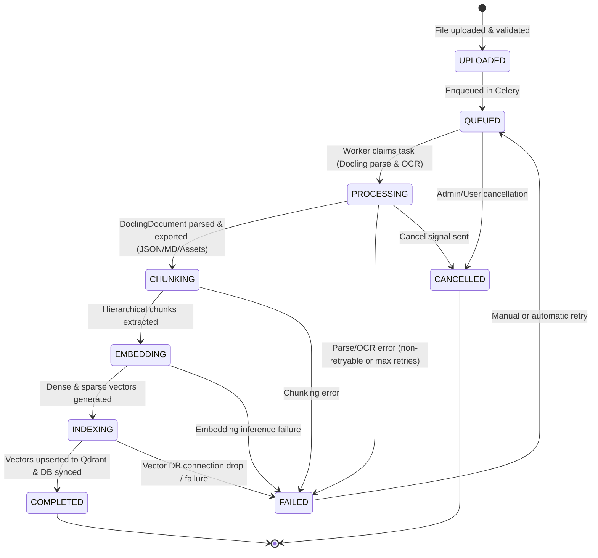
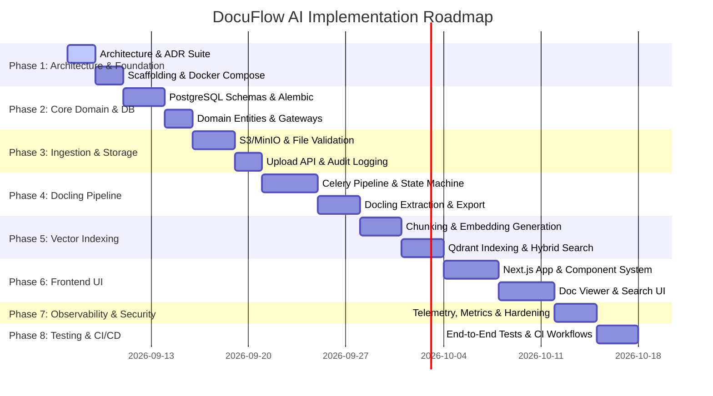

# DocuFlow AI: Production-Grade Technical Architecture & Implementation Plan

DocuFlow AI is an enterprise document intelligence and AI ingestion platform designed to parse multi-format unstructured documents (PDF, DOCX, PPTX, XLSX, HTML, Markdown, TXT, Images) using Docling, extract structured entities, layout hierarchy, and tabular data, chunk and embed them, and index them into Qdrant for semantic/hybrid search, exposed via a FastAPI backend and a Next.js modern web dashboard.

This plan details the full production architecture across 22 architectural dimensions, defines the documentation suite to be created in `/docs/` and `/docs/adr/`, and provides an actionable phased roadmap.

---

## 1. Overall System Architecture & Clean Architecture

The platform is designed as an **event-driven modular monolith** with strict layer decoupling following **Clean Architecture / Hexagonal Architecture** principles.



### Clean Architecture Boundaries
1. **Domain Layer (`app/domain/`)**:
   - Zero external dependencies (no FastAPI, no SQLAlchemy, no Celery, no Pydantic v2 DB decorators).
   - Contains core business entities (`Document`, `DocumentChunk`, `ProcessingJob`, `User`), value objects (`Checksum`, `MimeType`, `HeadingBreadcrumb`), domain events, and pure interface definitions (Abstract Gateways: `StorageGateway`, `VectorStoreGateway`, `DocumentParserGateway`, `EmbeddingGateway`).
2. **Application Layer (`app/application/`)**:
   - Contains use case orchestrators (e.g. `UploadDocumentUseCase`, `GetDocumentDetailsUseCase`, `SearchDocumentsUseCase`, `ProcessDocumentPipelineUseCase`).
   - DTOs, command/query definitions, validation logic, and transaction boundaries.
3. **Infrastructure Layer (`app/infrastructure/`)**:
   - Concrete gateway implementations:
     - Storage: `S3StorageService` (MinIO/AWS S3 via `boto3`).
     - Vector Store: `QdrantVectorRepository` (`qdrant-client`).
     - Parsing: `DoclingParserAdapter` (`docling.document_converter`).
     - Embeddings: `SentenceTransformerEmbeddingAdapter` / `OpenAIEmbeddingAdapter`.
     - Database: SQLAlchemy ORM models, session management, Alembic migrations.
     - Tasks: Celery task definitions, queues, and retries.
4. **API / Presentation Layer (`app/api/`)**:
   - FastAPI routers, HTTP request/response schemas (Pydantic), dependency injection (`Depends`), security middleware, rate limiters.
   - **Rule**: Absolutely no business logic in route handlers.

---

## 2. Component Architecture

| Component | Technology | Primary Responsibility | Isolation / Scaling Model |
| :--- | :--- | :--- | :--- |
| **Frontend UI** | Next.js 14+ (App Router), TypeScript, Tailwind/CSS Tokens | Document upload, pipeline progress tracking, visual structure viewer, markdown viewer, semantic search UI | Stateless, scaled horizontally via CDN / Node runtime |
| **API Server** | FastAPI, Python 3.11+, Uvicorn, Pydantic v2 | Authentication, file validation, presigned URLs, query dispatch, job monitoring | Stateless, scaled horizontally behind Load Balancer |
| **Worker: Parsing** | Celery, Docling, PyTorch, Tesseract/EasyOCR | File conversion, layout analysis, TableFormer, OCR extraction, markdown/JSON export | CPU/Memory/GPU bound; dedicated worker pool with low concurrency |
| **Worker: Embedding** | Celery, SentenceTransformers / ONNX / API Client | Hierarchical chunking, dense/sparse embedding computation, Qdrant batch upsert | I/O or GPU bound; independent queue & worker pool |
| **Relational DB** | PostgreSQL 16 | Relational metadata, users, versions, jobs, audit logs, chunks index | Primary-replica with PgBouncer connection pooling |
| **Task Queue / Cache** | Redis 7.2 | Celery broker, Celery backend, rate-limiting counters, token blocklist | In-memory with Redis AOF persistence |
| **Object Storage** | MinIO (local) / S3 (cloud) | Original binary files, parsed JSON representations, exported markdown, extracted images/tables | Distributed S3-compatible, immutable content-addressable storage |
| **Vector Database** | Qdrant | Dense vector search, sparse vector search, payload filtering (tenant, document, page) | Distributed HNSW indexing with memory-mapped storage |

---

## 3. Database ERD & Schema Design



### Table Definitions & Indexes
1. **`tenants`**: `id` (UUID, PK), `name`, `slug` (UNIQUE), `is_active`, `created_at`, `updated_at`.
2. **`users`**: `id` (UUID, PK), `tenant_id` (FK), `email` (UNIQUE), `hashed_password`, `full_name`, `role` (ADMIN, EDITOR, VIEWER), `is_active`, `created_at`, `updated_at`.
   - Index: `(tenant_id, email)`.
3. **`documents`**: `id` (UUID, PK), `tenant_id` (FK), `owner_id` (FK), `title`, `original_filename`, `file_type` (MimeType), `file_size_bytes`, `storage_path`, `checksum_sha256`, `current_version_id`, `is_deleted` (soft delete), `created_at`, `updated_at`.
   - Indexes: `(tenant_id, is_deleted)`, `(tenant_id, checksum_sha256)`, `(tenant_id, created_at DESC)`.
4. **`document_versions`**: `id` (UUID, PK), `document_id` (FK), `version_number` (INT), `storage_path`, `file_size_bytes`, `checksum_sha256`, `created_at`.
   - Unique Constraint: `(document_id, version_number)`.
5. **`document_assets`**: `id` (UUID, PK), `document_id` (FK), `version_id` (FK), `asset_type` (ORIGINAL, PARSED_JSON, EXPORT_MARKDOWN, EXTRACTED_IMAGE, TABLE_CSV), `storage_path`, `mime_type`, `size_bytes`, `metadata` (JSONB), `created_at`.
   - Index: `(document_id, asset_type)`.
6. **`processing_jobs`**: `id` (UUID, PK), `document_id` (FK), `version_id` (FK), `status` (Enum: UPLOADED, QUEUED, PROCESSING, CHUNKING, EMBEDDING, INDEXING, COMPLETED, FAILED, CANCELLED), `stage` (Enum), `progress_percent` (INT 0-100), `retry_count` (INT default 0), `max_retries` (INT default 3), `celery_task_id` (VARCHAR), `started_at`, `completed_at`, `created_at`, `updated_at`.
   - Indexes: `(status, created_at)`, `(document_id, created_at DESC)`, `celery_task_id`.
7. **`document_chunks`**: `id` (UUID, PK), `document_id` (FK), `version_id` (FK), `chunk_index` (INT), `content` (TEXT), `token_count` (INT), `heading_hierarchy` (JSONB), `page_numbers` (INT[]), `chunk_metadata` (JSONB), `created_at`.
   - Index: `(document_id, version_id, chunk_index)`.
8. **`embedding_records`**: `id` (UUID, PK), `chunk_id` (FK), `document_id` (FK), `model_name` (VARCHAR), `vector_dimension` (INT), `qdrant_point_id` (UUID), `created_at`.
   - Index: `qdrant_point_id`, `(chunk_id, model_name)`.
9. **`processing_errors`**: `id` (UUID, PK), `job_id` (FK), `document_id` (FK), `stage` (VARCHAR), `error_type` (VARCHAR), `error_message` (TEXT), `stack_trace` (TEXT), `retryable` (BOOLEAN), `created_at`.
   - Index: `(job_id, created_at)`.
10. **`audit_logs`**: `id` (UUID, PK), `tenant_id` (FK), `user_id` (FK nullable), `action` (VARCHAR), `resource_type` (VARCHAR), `resource_id` (UUID), `ip_address` (VARCHAR), `user_agent` (VARCHAR), `details` (JSONB), `created_at`.
    - Index: `(tenant_id, action, created_at DESC)`.

---

## 4. API Architecture

- **Protocol**: RESTful JSON over HTTPS, standard HTTP status codes, RFC 7807 Problem Details for errors.
- **Base Route**: `/api/v1`
- **Versioning Strategy**: URI path versioning (`/api/v1/`), allowing zero-downtime evolution.
- **Idempotency**: `Idempotency-Key` HTTP header supported on ingestion/mutation endpoints.
- **Authentication**: Bearer JWT in `Authorization` header, refresh token in HTTP-only secure cookie.

### Endpoints Breakdown
- **Authentication (`/api/v1/auth`)**:
  - `POST /register`: Initial user registration / tenant onboarding.
  - `POST /login`: OAuth2 password flow returning access & refresh tokens.
  - `POST /refresh`: Issue new access token using refresh token.
  - `POST /logout`: Revoke active refresh token in Redis blocklist.
  - `GET /me`: Return current user profile and permissions.
- **Documents (`/api/v1/documents`)**:
  - `POST /upload`: Multipart upload with validation; stores in S3, creates DB record, dispatches processing job.
  - `GET /`: List tenant documents with pagination, sorting, status/mime filters.
  - `GET /{document_id}`: Retrieve document metadata and latest processing status.
  - `DELETE /{document_id}`: Soft-delete document; triggers async cleanup of Qdrant points.
  - `GET /{document_id}/versions`: List version history.
  - `GET /{document_id}/assets/{asset_type}`: Retrieve asset or download presigned URL (e.g. original, markdown, JSON).
  - `GET /{document_id}/chunks`: Paginated chunk explorer with bounding box & heading hierarchy.
- **Processing Jobs (`/api/v1/jobs`)**:
  - `GET /{job_id}`: Get real-time job stage, progress percent, and error history.
  - `POST /{job_id}/retry`: Manually retry a failed processing job.
  - `POST /{job_id}/cancel`: Cancel an active job (revokes Celery task).
- **Search (`/api/v1/search`)**:
  - `POST /`: Semantic, keyword (BM25), or hybrid search.
    - Query payload: `query` (string), `limit` (int), `score_threshold` (float), `filters` (tenant_id, document_ids, file_types, page_numbers).
    - Response payload: Scored chunks with breadcrumbs, snippets, highlighted text, and document metadata.
- **Health & Monitoring (`/health`)**:
  - `GET /live`: Liveness probe (process running).
  - `GET /ready`: Readiness probe (validates PostgreSQL, Redis, MinIO, and Qdrant connectivity).
  - `GET /metrics`: Prometheus formatted application metrics.

---

## 5. Frontend Architecture (Next.js & TypeScript)

- **Framework**: Next.js 14+ (App Router), React 18/19, TypeScript strict mode.
- **Styling**: Vanilla CSS custom design system with CSS custom properties (tokens) for dark/light mode, glassmorphism, responsive grid, and micro-animations.
- **State Management**: Zustand for client-side UI states (modal states, active filters, search state) + TanStack Query (React Query) for server state caching, pagination, and real-time polling.
- **Component Hierarchy**:
  - `components/layout/`: AppShell, Sidebar, Header, UserMenu, Breadcrumbs.
  - `components/upload/`: Dropzone, FilePreviewList, UploadProgressIndicator, ValidationBadge.
  - `components/documents/`: DocumentTable, StatusBadge, DocumentFilterBar, ActionDropdown.
  - `components/viewer/`:
    - `DocumentViewer`: Master layout (split view: source / parsed).
    - `StructureTree`: Interactive hierarchical tree of headings, sections, tables, figures.
    - `MarkdownView`: Rendered Markdown with syntax highlighting and table view.
    - `ChunkInspector`: Bounding box overlay and metadata inspector modal.
  - `components/search/`: SearchBar, FilterDrawer, SearchResultCard, ScoreIndicator, ChunkSnippetModal.
- **Real-Time Job Updates**: SSE (Server-Sent Events) or smart polling with exponential backoff via TanStack Query.

---

## 6. Comprehensive Folder Structure

```text
docuflow-ai/
├── .github/
│   └── workflows/
│       ├── ci.yml                 # Lint, typecheck, unit & integration tests
│       └── docker-build.yml       # Production container builds
├── backend/
│   ├── alembic/                   # Database migrations
│   │   ├── versions/
│   │   └── env.py
│   ├── app/
│   │   ├── __init__.py
│   │   ├── main.py                # FastAPI factory & lifecycle hooks
│   │   ├── config.py              # Pydantic Settings (environment config)
│   │   ├── api/                   # Presentation Layer
│   │   │   ├── dependencies.py    # DB, Auth, Gateway injections
│   │   │   ├── middleware.py      # Correlation ID, rate limit, error handler
│   │   │   └── v1/
│   │   │       ├── auth.py
│   │   │       ├── documents.py
│   │   │       ├── jobs.py
│   │   │       └── search.py
│   │   ├── application/           # Use Cases & Orchestration
│   │   │   ├── auth/
│   │   │   ├── documents/
│   │   │   ├── jobs/
│   │   │   └── search/
│   │   ├── domain/                # Enterprise Business Rules & Interfaces
│   │   │   ├── entities/
│   │   │   ├── value_objects/
│   │   │   ├── exceptions.py
│   │   │   └── interfaces/        # Abstract Gateways (Storage, Parser, Vector, etc.)
│   │   └── infrastructure/        # Frameworks & Drivers
│   │       ├── database/          # SQLAlchemy session & ORM models
│   │       ├── storage/           # S3 / MinIO adapter
│   │       ├── vector/            # Qdrant adapter
│   │       ├── parser/            # Docling parsing adapter
│   │       ├── embeddings/        # SentenceTransformer / OpenAI adapter
│   │       ├── security/          # JWT, Argon2/Bcrypt, ClamAV
│   │       ├── logging/           # Structlog configuration
│   │       └── tasks/             # Celery worker application & task pipelines
│   ├── tests/
│   │   ├── unit/
│   │   ├── integration/
│   │   └── fixtures/              # Sample PDF, DOCX, XLSX files
│   ├── Dockerfile
│   ├── pyproject.toml
│   └── alembic.ini
├── frontend/
│   ├── public/
│   ├── src/
│   │   ├── app/                   # Next.js App Router (pages & layouts)
│   │   │   ├── layout.tsx
│   │   │   ├── page.tsx
│   │   │   ├── login/
│   │   │   ├── documents/
│   │   │   │   ├── page.tsx
│   │   │   │   └── [id]/page.tsx
│   │   │   └── search/
│   │   ├── components/            # Reusable UI primitives & domain components
│   │   ├── hooks/                 # Custom React hooks (useDocuments, useSearch)
│   │   ├── lib/                   # API client, token storage, utilities
│   │   ├── styles/                # CSS tokens, theme variables, animations
│   │   └── types/                 # TypeScript interfaces and API schemas
│   ├── package.json
│   ├── tsconfig.json
│   └── Dockerfile
├── docs/                          # Architecture & Specifications
│   ├── architecture.md
│   ├── database.md
│   ├── api.md
│   ├── processing-pipeline.md
│   ├── security.md
│   ├── deployment.md
│   ├── development-roadmap.md
│   └── adr/                       # Architectural Decision Records
│       ├── 0001-modular-monolith-clean-architecture.md
│       ├── 0002-docling-document-intelligence-engine.md
│       ├── 0003-celery-redis-asynchronous-pipeline.md
│       ├── 0004-qdrant-vector-database-and-hybrid-search.md
│       └── 0005-s3-compatible-storage-abstraction.md
├── docker-compose.yml             # Local dev multi-container stack
├── docker-compose.prod.yml        # Production stack template
└── README.md
```

---

## 7. Document Processing State Machine

The document processing pipeline operates as a deterministic, idempotent finite state machine with automatic retry backoff on transient errors and dead-letter tracking.



### State Definitions & Transitions
1. **UPLOADED**: File received by FastAPI, passed MIME magic byte validation, saved to S3 raw bucket, `Document` and `DocumentVersion` records created in PostgreSQL.
2. **QUEUED**: `ProcessingJob` created with status `QUEUED`, task dispatched to Celery `parsing` queue.
3. **PROCESSING**: Celery parser worker picks up the job. Docling initializes `DocumentConverter` with appropriate pipeline options (PDF layout analysis, OCR for scanned pages, TableFormer for XLSX/PDF tables). Outputs: `DoclingDocument` JSON, Markdown export, extracted images/tables saved to S3.
4. **CHUNKING**: Docling's `HierarchicalChunker` (or `HybridChunker`) segments the structured document into semantic chunks preserving heading breadcrumbs, table cells, and page references.
5. **EMBEDDING**: Text chunks converted into dense vectors using embedding model (e.g. `bge-small-en-v1.5` or configured provider) in batch mode.
6. **INDEXING**: Chunks and vectors upserted into Qdrant collection with rich metadata payload. Relational records (`DocumentChunk`, `EmbeddingRecord`) written in PostgreSQL.
7. **COMPLETED**: Processing job marked completed with duration metrics.
8. **FAILED**: Any unhandled exception or retry exhaustion transitions to `FAILED`. A `ProcessingError` record is created with stack trace and retryable flag.
9. **CANCELLED**: User aborts job; worker detects revocation token and ceases execution.

---

## 8. Celery Task Architecture

- **Broker**: Redis (`redis://redis:6379/0`) with visibility timeout configured to 3600 seconds.
- **Result Backend**: Redis (`redis://redis:6379/1`) for task tracking and status introspection.
- **Queues**:
  - `parsing`: Dedicated to CPU/Memory-intensive Docling tasks. Concurrency: `2-4` per worker instance to prevent OOM.
  - `indexing`: Dedicated to I/O-bound chunking, embedding, and Qdrant ingestion. Concurrency: `4-8` per worker.
  - `maintenance`: System maintenance (soft-deleted file purges, audit log rotation).
- **Task Orchestration**:
  - Either Celery canvas chain: `docling_parse.s(job_id) | chunk_and_embed.s() | index_to_qdrant.s()`
  - Or a master workflow coordinator task with granular checkpoints after each stage.
- **Idempotency**:
  - Checkpoint verification: Before executing each stage, worker checks `document_assets` and `processing_jobs` state. If stage outputs exist, skip to next stage.
- **Retry Strategy**:
  - Exponential backoff with jitter: `autoretry_for=(TransientStorageError, ModelInferenceError), retry_backoff=True, retry_backoff_max=300, max_retries=3`.

---

## 9. Storage Architecture (S3 / MinIO)

- **Storage Structure**:
  ```text
  docuflow-documents/
  ├── tenants/{tenant_id}/
  │   └── documents/{document_id}/
  │       ├── v1/
  │       │   ├── raw/{safe_filename}               # Original binary
  │       │   ├── parsed/docling_document.json      # Structured Docling model
  │       │   ├── exports/content.md                # Normalized markdown
  │       │   ├── assets/
  │       │   │   ├── images/{img_hash}.png         # Extracted figures
  │       │   │   └── tables/{table_hash}.csv       # Extracted tables
  ```
- **Security & Integrity**:
  - Presigned GET/PUT URLs with 15-minute expiration for secure asset streaming.
  - SHA-256 checksum calculated on streaming upload to guarantee data integrity.
  - Content-Type enforcement via magic bytes (`python-magic` / `puremagic`).

---

## 10. Qdrant Collection Design

- **Collection Name**: `docuflow_chunks`
- **Vector Configuration**:
  - Dense Vector: Dimension `384` (for default `all-MiniLM-L6-v2` or `bge-small-en-v1.5`) or `1536` (OpenAI), Distance: `Cosine`.
  - On-disk indexing enabled for scalar and vector storage to optimize RAM usage.
  - HNSW index: `m=16`, `ef_construct=128`.
- **Payload Schema**:
  ```json
  {
    "tenant_id": "3fa85f64-5717-4562-b3fc-2c963f66afa6",
    "document_id": "7ca64e81-b518-4b72-97fc-112233445566",
    "version_id": "18f92113-1122-3344-5566-778899aabbcc",
    "chunk_id": "a901e012-3344-5566-7788-99aabbccddee",
    "chunk_index": 4,
    "text": "Extracted paragraph content...",
    "page_numbers": [2],
    "heading_hierarchy": ["1. Executive Summary", "1.2 Revenue Breakdown"],
    "item_type": "paragraph",
    "file_type": "application/pdf",
    "created_at": 1725638400
  }
  ```
- **Payload Indexes (Filtered Keys)**:
  - `tenant_id` (Keyword): **Mandatory** security filter on every search.
  - `document_id` (Keyword): Filter by specific documents.
  - `page_numbers` (Integer): Filter by page range.
  - `heading_hierarchy` (Keyword): Filter by section context.
  - `text` (Full-Text): Used for hybrid lexical + dense search.

---

## 11. Security Architecture

1. **Tenant & Data Isolation**:
   - Every database query mandates `tenant_id` WHERE clause enforced at repository layer.
   - Every Qdrant search must contain `FieldCondition(key="tenant_id", match=MatchValue(value=current_tenant_id))`.
2. **Authentication & Tokens**:
   - Access tokens: JWT signed with HMAC-SHA256 or asymmetric RS256, expiration: 15 minutes.
   - Refresh tokens: Cryptographically secure random tokens stored hashed in PostgreSQL with expiration (7 days); revocation support via Redis blocklist.
   - Password hashing: Argon2id (or Bcrypt with work factor 12).
3. **Ingestion & File Security**:
   - Strict MIME validation: Validates file extension against binary magic bytes.
   - File size caps: Configurable max upload size (default: 50MB per file).
   - Safe filename sanitization: Strips path traversal characters (`../`, `..\`, null bytes); generates randomized UUID-backed storage keys.
   - Malware scanning hook: Pluggable `MalwareScannerGateway` with ClamAV daemon integration (or passthrough scanner for dev).
4. **Network & Transport**:
   - CORS policy with strict allowlist.
   - Security headers: Content-Security-Policy (CSP), Strict-Transport-Security (HSTS), X-Content-Type-Options, X-Frame-Options.
   - Rate limiting: Redis-backed sliding window on `/api/v1/auth` and `/api/v1/documents/upload`.

---

## 12. Observability Architecture

- **Structured Logging**: `structlog` generating JSON logs in production, injecting `correlation_id`, `tenant_id`, `user_id`, `document_id`, and `job_id` into every log record.
- **Metrics**: `prometheus-fastapi-instrumentator` exposing `/metrics`:
  - `docuflow_documents_uploaded_total`
  - `docuflow_job_duration_seconds` (histogram by stage: parsing, chunking, embedding, indexing)
  - `docuflow_job_failures_total` (counter by stage and error type)
  - `docuflow_active_celery_tasks`
- **Tracing**: OpenTelemetry SDK auto-instrumenting FastAPI, SQLAlchemy queries, Redis calls, and Celery tasks, exportable to Jaeger / Grafana Tempo.
- **Health Checks**:
  - `/health/live`: Simple ping.
  - `/health/ready`: Deep health check verifying PostgreSQL pool, Redis ping, MinIO bucket access, Qdrant cluster status.

---

## 13. Testing Strategy

1. **Unit Tests (`tests/unit/`)**:
   - Domain entity behavior, state transitions, validation value objects.
   - Application use-case testing with mocked gateways.
   - Chunker logic and breadcrumb generation tests.
2. **Integration Tests (`tests/integration/`)**:
   - API endpoints using FastAPI `TestClient` / `httpx.AsyncClient`.
   - PostgreSQL repository tests with isolated test DB schema.
   - MinIO & Qdrant integration tests using local test fixtures or Docker containers.
3. **End-to-End Tests**:
   - Playwright browser tests covering: User login -> Upload PDF -> Monitor processing progress to 100% -> View document viewer -> Execute semantic search -> Validate result snippets.
4. **Test Fixtures**:
   - Suite of test files in `tests/fixtures/`: PDF (digital + scanned), DOCX (nested tables), PPTX, XLSX (multi-sheet), TXT, Markdown, HTML, TIFF.

---

## 14. Local Development Architecture

- Multi-container local environment using `docker-compose.yml`:
  - `postgres`: PostgreSQL 16 on port 5432.
  - `redis`: Redis 7 on port 6379.
  - `minio`: MinIO S3 server on port 9000 (API) and 9001 (Console).
  - `qdrant`: Qdrant vector database on port 6333.
  - `backend-api`: FastAPI with hot-reloading via Uvicorn.
  - `celery-worker`: Celery worker with hot-reload watching backend directory.
  - `frontend`: Next.js development server with hot-module reloading on port 3000.
- Single command boot: `docker compose up --build`.

---

## 15. Production Deployment Architecture

- **Containerization**: Multi-stage Dockerfiles:
  - Base: Debian-slim with Python 3.11.
  - Docling dependencies: Minimal runtime with OCR libraries (libgl1, tesseract-ocr, libmagic).
  - Non-root user: `appuser` (UID 10001) for strict container security.
- **Topology**:
  - Frontend: Scaled Next.js node servers or static export behind Cloudflare / CDN.
  - Ingress: Nginx / Traefik reverse proxy with TLS termination and gzip/brotli compression.
  - API Cluster: Horizontally scaled FastAPI containers behind round-robin load balancer.
  - Celery Cluster: Dedicated autoscaling worker pools for `parsing` (compute/memory heavy) and `indexing` (I/O heavy).
  - Managed Databases: Amazon RDS / Cloud SQL for PostgreSQL, Amazon S3, Qdrant Cloud or dedicated Qdrant cluster.

---

## 16. CI/CD Architecture (GitHub Actions)

- **Workflow 1: Pull Request Quality Gate (`ci.yml`)**:
  - Static Analysis: `ruff check` and `ruff format --check` for Python; `eslint` and `prettier` for Next.js.
  - Type Checking: `mypy --strict` for backend; `tsc --noEmit` for frontend.
  - Automated Tests: `pytest` with coverage report; fail if coverage < 85%.
  - Security Scanning: `bandit` for AST vulnerabilities; `pip-audit` / `npm audit` for CVEs.
- **Workflow 2: Container Build & Publish (`docker-build.yml`)**:
  - Triggered on merge to `main`.
  - Multi-arch Docker build (amd64/arm64) using Buildx with GitHub Actions layer caching.
  - Push images tagged with Git SHA and `latest` to GitHub Container Registry (GHCR).

---

## 17. Environment Variable Strategy

- Strict schema validation using **Pydantic Settings** (`BaseSettings`).
- Application refuses to start if required environment variables are missing or misconfigured.
- Environments: `.env.example`, `.env.test`, `.env.production`.
- Secrets (JWT secrets, DB passwords, S3 secret keys) injected at runtime via environment variables or cloud secret managers (AWS Secrets Manager / HashiCorp Vault), never committed to Git.

---

## 18. Error Handling Strategy

- All custom exceptions inherit from base `DocuFlowException`.
- Explicit domain exceptions: `DocumentNotFoundException`, `UnsupportedFileFormatException`, `FileTooLargeException`, `CorruptedFileException`, `ParsingPipelineException`, `TenantAccessViolationException`.
- FastAPI global exception handlers format all errors according to **RFC 7807 (Problem Details for HTTP APIs)**:
  ```json
  {
    "type": "https://docuflow.ai/errors/unsupported-file-format",
    "title": "Unsupported File Format",
    "status": 415,
    "detail": "The uploaded file 'contract.xyz' is not an accepted MIME type.",
    "instance": "/api/v1/documents/upload",
    "correlation_id": "req-98f21-bc"
  }
  ```

---

## 19. Logging Strategy

- **Format**: JSON in production, colored human-readable text in development.
- **Contextual Fields**: Every log message automatically binds:
  - `timestamp`: ISO-8601 UTC.
  - `level`: DEBUG, INFO, WARNING, ERROR, CRITICAL.
  - `correlation_id`: Propagated from HTTP request header `X-Correlation-ID` to Celery tasks.
  - `tenant_id`, `user_id`, `document_id`, `job_id`.
- **Sensitive Data Redaction**: Automatic scrubbing of passwords, authorization tokens, and personal email addresses from logs.

---

## 20. Scalability Strategy

- **Stateless API**: API instances carry no session state; sessions managed via JWT.
- **Celery Worker Scaling**: Independent horizontal scaling of parsing workers and indexing workers based on Redis queue length (`docuflow.parsing` backlog vs `docuflow.indexing` backlog).
- **Database Scaling**: Read replicas for document list queries and analytics; PgBouncer for handling high-concurrency client connections.
- **Qdrant Scaling**: Qdrant distributed clustering with shard replicas and collection partitioning by tenant or time-based segments.

---

## 21. Backup & Disaster Recovery Strategy

- **PostgreSQL**: Continuous WAL archiving (Point-In-Time Recovery) + daily automated `pg_dump` snapshots stored in cold S3 storage.
- **S3 / MinIO**: Object versioning enabled, cross-region replication for production document buckets, 30-day lifecycle retention for soft-deleted files.
- **Qdrant**: Daily automated snapshots via Qdrant Snapshot API (`POST /collections/{collection_name}/snapshots`) backed up to S3.
- **RPO & RTO Targets**: Recovery Point Objective (RPO) < 1 hour; Recovery Time Objective (RTO) < 4 hours.

---

## 22. Phased Development Roadmap



- **Phase 1: Architecture & Foundation Documentation (Current Phase)**
  - Deliverables: Complete documentation suite in `/docs/` and `/docs/adr/`.
- **Phase 2: Project Scaffolding & Core Domain**
  - Deliverables: Directory layout, Pydantic settings, SQLAlchemy models, Alembic migrations, Clean Architecture interfaces.
- **Phase 3: Storage & Ingestion Layer**
  - Deliverables: MinIO storage gateway, MIME & magic byte validator, file size limiter, upload endpoints, audit logger.
- **Phase 4: Docling Ingestion Pipeline & Celery Tasks**
  - Deliverables: Celery application, Docling parser adapter, state machine transitions, Markdown/JSON asset generators.
- **Phase 5: Chunking, Embeddings & Qdrant Vector Indexing**
  - Deliverables: Docling HierarchicalChunker, vector embedding adapter, Qdrant collection setup, hybrid search service.
- **Phase 6: Frontend Dashboard & Intelligence Viewer**
  - Deliverables: Next.js dashboard, upload dropzone, live job tracker, document visual structure viewer, semantic search portal.
- **Phase 7: Security Hardening & Observability**
  - Deliverables: JWT access/refresh token rotation, rate limiting, structlog correlation tracking, Prometheus metrics exporter.
- **Phase 8: Comprehensive Testing & CI/CD**
  - Deliverables: Pytest test suite, Playwright E2E tests, GitHub Actions CI workflows, Docker production builds.

---

## Proposed Changes to Implement

The following production documentation suite and architectural decision records (ADRs) will be created:

### Documentation Suite (`/docs/`)

#### [NEW] [architecture.md](file:///e:/Projects/DocuFlow%20AI/docs/architecture.md)
Comprehensive technical architecture, clean architecture boundaries, component diagrams, message flow, layer responsibilities, and system topology.

#### [NEW] [database.md](file:///e:/Projects/DocuFlow%20AI/docs/database.md)
Complete database schema, PostgreSQL ERD, table definitions, indexes, foreign keys, partitioning recommendations, and Alembic migration workflow.

#### [NEW] [api.md](file:///e:/Projects/DocuFlow%20AI/docs/api.md)
Full REST API specification, route definitions, request/response models, RFC 7807 error format, authentication flow, and idempotency handling.

#### [NEW] [processing-pipeline.md](file:///e:/Projects/DocuFlow%20AI/docs/processing-pipeline.md)
In-depth specification of the Docling ingestion engine, pipeline state machine, Celery tasks, hierarchical chunking, OCR strategy, retry mechanism, and asset generation.

#### [NEW] [security.md](file:///e:/Projects/DocuFlow%20AI/docs/security.md)
Security architecture covering authentication, authorization, tenant isolation, file validation, path traversal defense, rate limiting, and malware scanning abstraction.

#### [NEW] [deployment.md](file:///e:/Projects/DocuFlow%20AI/docs/deployment.md)
Deployment blueprint for local development (Docker Compose) and production (containers, reverse proxy, managed databases, backups, disaster recovery).

#### [NEW] [development-roadmap.md](file:///e:/Projects/DocuFlow%20AI/docs/development-roadmap.md)
Phased engineering plan detailing task breakdown, dependencies, and Definition of Done for Phases 1 through 8.

### Architectural Decision Records (`/docs/adr/`)

#### [NEW] [0001-modular-monolith-clean-architecture.md](file:///e:/Projects/DocuFlow%20AI/docs/adr/0001-modular-monolith-clean-architecture.md)
ADR adopting a modular monolith with Clean Architecture principles over microservices for maintainability and team velocity.

#### [NEW] [0002-docling-document-intelligence-engine.md](file:///e:/Projects/DocuFlow%20AI/docs/adr/0002-docling-document-intelligence-engine.md)
ADR adopting IBM Docling for multi-format document layout analysis, reading order, table parsing, and structured representations.

#### [NEW] [0003-celery-redis-asynchronous-pipeline.md](file:///e:/Projects/DocuFlow%20AI/docs/adr/0003-celery-redis-asynchronous-pipeline.md)
ADR choosing Celery + Redis for asynchronous background document ingestion, retries, and task orchestration.

#### [NEW] [0004-qdrant-vector-database-and-hybrid-search.md](file:///e:/Projects/DocuFlow%20AI/docs/adr/0004-qdrant-vector-database-and-hybrid-search.md)
ADR selecting Qdrant for vector embeddings, payload filtering, and hybrid semantic/lexical search.

#### [NEW] [0005-s3-compatible-storage-abstraction.md](file:///e:/Projects/DocuFlow%20AI/docs/adr/0005-s3-compatible-storage-abstraction.md)
ADR implementing S3-compatible object storage abstraction with MinIO for local dev and AWS S3 / Cloud Storage for production.

---

## Verification Plan

### Automated Checks
- Validate that all markdown documentation files and ADRs render correctly without broken internal links.
- Run a markdown/link validation script on `/docs/` and `/docs/adr/`.

### Manual Review
- Review each architecture document against the prompt's 22 required areas to ensure complete coverage.
- Confirm ADR structure follows Michael Nygard's standard ADR template (Context, Decision, Consequences, Status).
